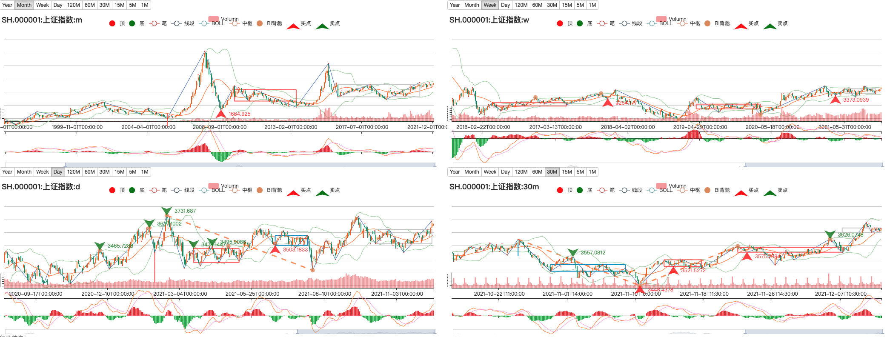
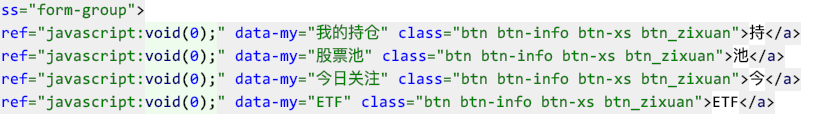
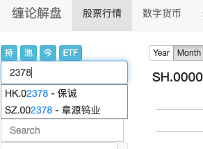

# 缠论市场分析工具

---

本项目是基于 缠中说禅 所分享的缠论知识，结合个人理解，用于学习和研究市场行情的分析工具；  
因为个人能力有限，理解可能会有偏差的地方，所以项目所实现的缠论，必然有错误之处；  
所以决定开源出来，希望大家一起学习并加以完善。

### 特别说明

项目原本是个人学习与研究缠论所用，并且对于 Python 了解不多，代码用的比较简单，基本没有用到什么高深技术，对于初学 Python 的人来说相对友好，花点时间都能看懂；  
其中 WEB 输入参数，并没有多加校验，完全凭借人之本善加以约束，在使用中还请注意；  

### 项目当前功能

* 缠论图表展示
* 行情数据下载（A股、港股、数字货币）
* 行情回放练习
* 自定义缠论策略进行回测
* 实盘策略交易

### 安装

1. 克隆项目到本地 （git clone https://github.com/yijixiuxin/chanlun.git）
2. 安装 [Anaconda](https://www.anaconda.com/) ，创建运行环境，Python 版本 3.7
3. pip 安装项目依赖包 ( pip install -r requirements.txt )
4. 使用 Anaconda 安装 JupyterLab，用于本地进行研究使用
5. 在 cl_v2 目录，复制拷贝 config.py.demo 文件为 config.py ，用于配置整个项目的配置参数
6. 到 web 目录，运行 python manage.py runserver 0.0.0.0:8000 启动 web 服务
7. 浏览器访问 http://127.0.0.1:8000/charts/stock_index/ 即可显示缠论主页

### 配置文件说明

* 代理服务器配置  
如果需要使用数字货币行情，则需要进行配置；   
项目中实现了 币安交易所的 USDT 永续合约行情与交易，可直接配置 API 进行使用；   
数字货币行情与交易，基于 [ccxt](https://github.com/ccxt/ccxt) 包实现，可以很方便进行其他交易所的实现；  
如没有好用的 vpn，推荐我自己使用的 [V2free](https://w1.ddnsgo.xyz/auth/register?code=RFb5) 服务 （PS：使用我的链接注册，我可以获得返利） 
   
* 富途 API 配置  
我自己主要使用的行情服务，同时也可以进行 港股 的自动化交易，推荐使用；  
[OpenAPI](https://www.futunn.com/download/OpenAPI?lang=zh-CN)  
不足之处就是获取股票 K 线有限制 [API文档](https://openapi.futunn.com/futu-api-doc/intro/authority.html)  
开户用户每月只能获取 100 只股票K线（可多次获取），总资产达1万港币则为 300   
我的用法为：在聚宽平台研究环境筛选符合条件的股票，在使用 富途API 获取行情精选查看，这样 300 个已经够用了。

* Redis、Mysql 配置   
K线 同步到本地，使用 Mysql 进行保存，程序会自动创建表，需要给表创建的权限；  
Redis 用于保存非结构化的一些数据，用于实现一些信息的保存；如 股票盯盘结果查看、实盘实例保存等；

* 钉钉消息配置  
用于发送推送消息 [API 文档](https://open.dingtalk.com/document/robots/custom-robot-access)

### 研究环境

克隆代码到本地，配置好相应的配置，开启本地 JupyterLab，浏览器访问 ： http://127.0.0.1:8888/lab/tree   

项目根目录有写好的一些实例，可直接运行查看，并按需要修改测试

### 聚宽平台

缠论计算类 cl.py 可以在聚宽平台直接使用，可以复制代码到聚宽的研究环境中使用；   
项目目录 joinquant 有相应的实例，以及行业、概念板块的动量排行计算；
可直接上传 A股动量排行选股择时.ipynb / cl.py / fun.py 到研究环境中运行；
> ps: 这里的 cl.py 与项目中 cl_v2/cl.py 是同一个文件

### WEB 网页

到 web 目录，运行 python manage.py runserver 0.0.0.0:8000 启动 web 服务   
访问：http://127.0.0.1:8000/charts/stock_index/

> PS：页面只根据我自己的显示屏进行了适配，不保证所有分辨率大小下都能显示正常；   
> 如有显示异常，可自行尝试修改；  
> 如有前端大神愿意优化，也很欢迎提交代码，感激不尽！

web 服务中，股票行情使用 富途API 实现，其中股票列表是基于在富途设置的自选实现
  
可根据自己需求进行修改，行情服务也可以自定义去实现，继承 Exchange 类并实现相应方法即可； 

页面左上角输入框，支撑股票搜索，输入关键字即可
 

页面中行情默认不自动刷新，有按钮 <开启自动刷新> 信息手动开启，javascript 会轮训方式请求行情并刷新。

动量排行页面，需要使用 聚宽平台 运行出的结果，复制后手动新增到项目中，才可正常进行展示；  
（聚宽平台代码在项目 joinquant 目录中）

其他功能自行摸索吧，有特别说明的后续在补充......

### 行情数据同步到本地

支持将行情保存到本地数据库，实例可查看根目录中的 《同步行情到数据库.ipynb》  
同时也已经实现了 自动化脚本：
* cl_v2/scripts/reboot_sync_currency_klines.py 同步数字货币到数据库
* cl_v2/scripts/reboot_sync_stock_klines.py 同步股票数据到数据库

可自行查看具体代码实现

### 策略回测

回测行情数据基于本地 MySQL 中的数据，所以在回测前需要确认本地是否有回测时间段的行情数据

回测的类为 : [cl_v2/trader.py](cl_v2/trader.py)  
策略的类为 : [cl_v2/strategy.py](cl_v2/strategy.py)

自己写的策略，需要继承 Strategy 类，并实现其中的 look、stare 方法
Demo 实例参考 ： [cl_v2/my/strategy_two.py](cl_v2/my/strategy_two.py)

回测运行实例参考：[数字货币策略回测.ipynb](数字货币策略回测.ipynb)

> PS: 回测比较慢，因为每次 bar 的更新，都需要计算全部的缠论数据

### 实盘策略交易

策略经过回测验证，满足自己要求，即可接入实盘进行交易；
实盘的交易对像需要继承 [cl_v2/trader.py](cl_v2/trader.py)   
实现其中的 open_buy/open_sell/close_buy/close_sell 交易方法即可  
暂时没有 Demo ，后续在补充上......

### 赞助
开发维护不易，如果觉得项目对你有帮助，还请多多支持

BTC : 36Rc4vuVL6ogJrw6SMsjPMqEHGmY1SBxYi  
ETH : 0xEae26eaaa3b7ce6E7b0B991Ca14C8Ed744ECd21f