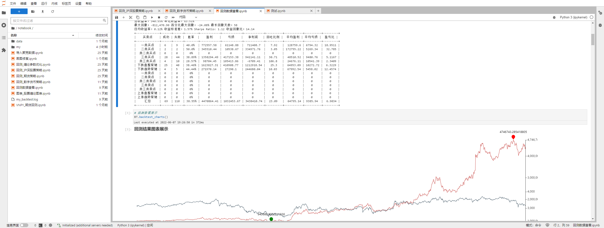

### JupyterLab 安装与使用

---

JupyterLab 作为一种基于 web 的集成开发环境，可以很方便在网页进行编写并运行 Python 代码。

项目中策略回测与查看主要是在 JupyterLab 运行，建议使用。

* 介绍：https://zhuanlan.zhihu.com/p/87403131

* 安装 JupyterLab

```
    conda activate chanlun
    conda install -y -c conda-forge jupyterlab jupyterlab_widgets jupyterlab-lsp jupyterlab_execute_time jupyterlab-language-pack-zh-CN
    pip3 install pygwalker
    cd chanlun-pro
    jupyter-lab  # 启动
```

#### 运行示例
