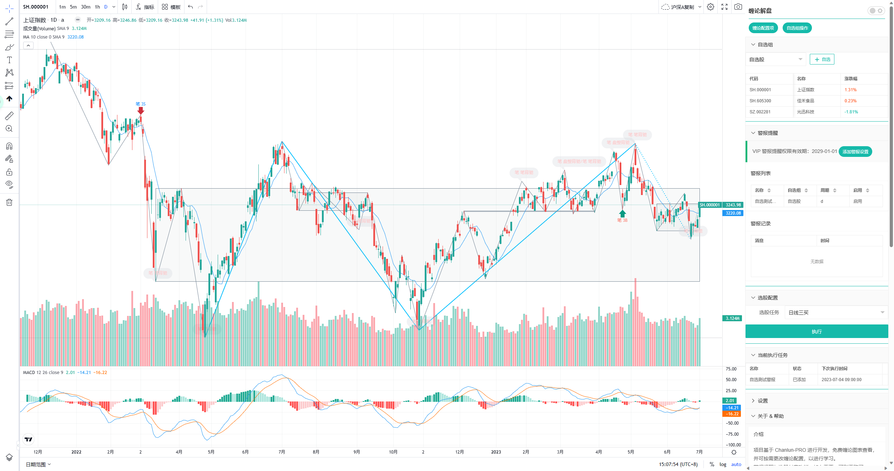

# 缠论解盘 - Windows版本

---

### Window版本 基于 Chanlun-Pro 项目开发的免费桌面程序；

### 最新版本：V1.0.3

_更新时间：2023-07-22_

扫码入QQ群，在群文件中进行下载使用；

行情数据只包括沪深A股市场；

可免费看图，并根据需求自行更改缠论配置；

自定义自选组；

付费功能：【警报提醒】/ 【选股】

### 更新日志

### V1.0.3 (2023-07-22)

* 修复k线数据显示不全bug
* 缠论计算：拆分三类买卖点情况，非为 9段内与 9段及以上 中枢的三类买卖点，可自行配置

#### V1.0.2 (2023-07-17)

* 升级 Tradingviews 图表库版本
* 调整页面结构
* 修复BUG

#### V1.0.1 (2023-07-03)

* 新的基于网页的 Windows 上线

### 程序展示

> 沪深A股行情

