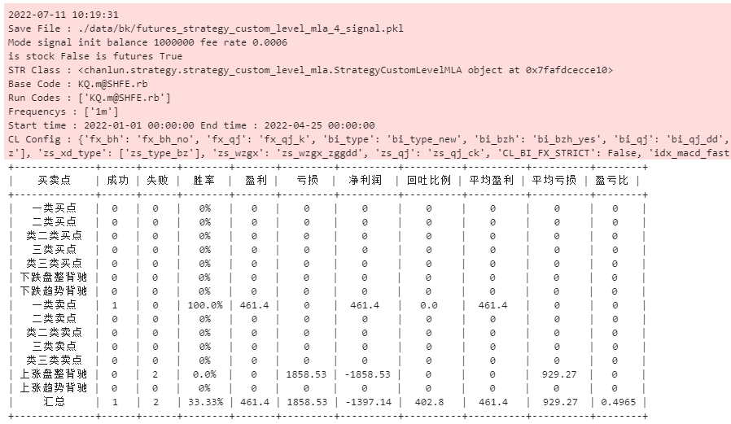
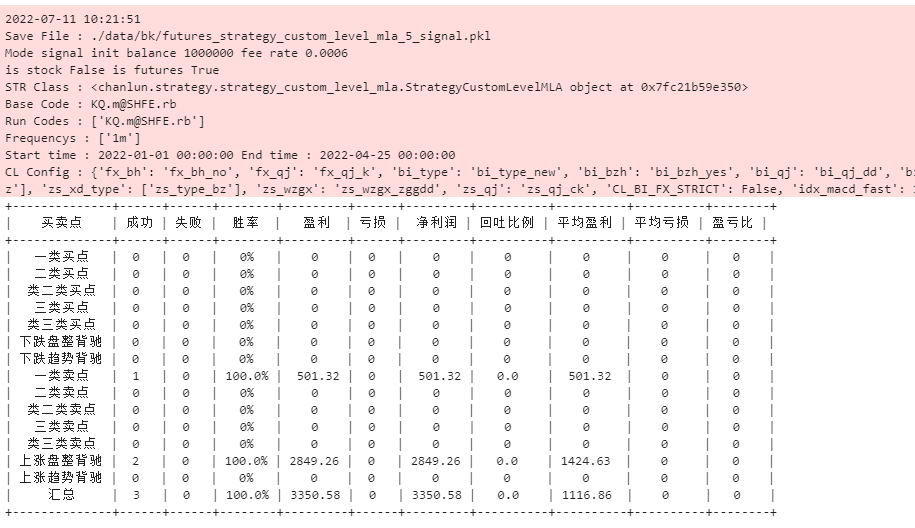
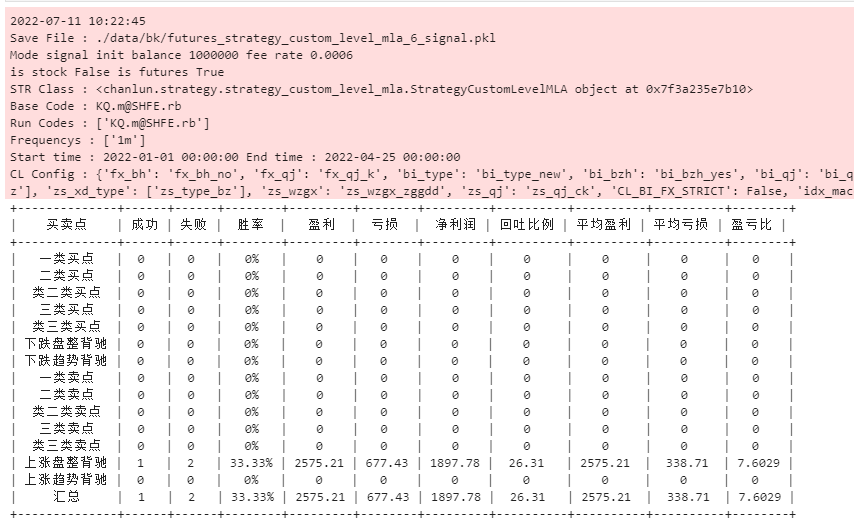
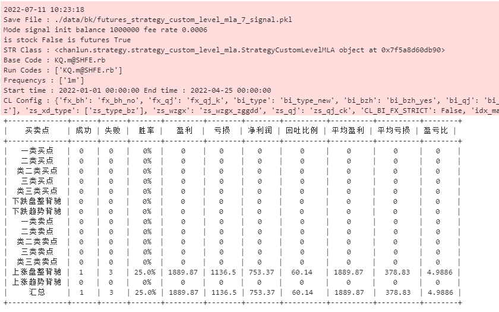

## 合成自定义K线数据（分钟）

---

> 声明：回测结果不代表实盘运行效果，展示的策略示例只适合学习，不可直接用于实盘交易

目前项目中回测使用的数据，使用的是已经保存到数据库中，固定周期的K线数据；如 1分钟、5分钟、30分钟、日线 等；

有时自己想测试下另类周期的数据，比如 3分钟、7分钟、15分钟、20分钟 等周期数据，但是数据库中并没有保存该周期数据；

现在提供一个 `KlinesGenerator` K线生成的类，来提供特定周期（分钟）K线数据进行策略回测。

---

**设想：在期货中的一个品种，在 6分钟 K线上的走势看起来更规整，其低级别也正好对应 1分钟 走势，用多级别分析来判断 6分钟 笔是否结束，来进行交易策略**

策略文件：`src/strategy/strategy_custom_level_mla.py`

#### 策略说明

通过低级别 K线，合成高级别K线，并用多级别分析，来判断高级别笔是否完成

> 市场：期货
>
> 周期：单周期（内部合成多周期）
>
> 开仓策略：高级别笔出现买卖点，并多级别分析中，低级别出现盘整或趋势背驰，进行开仓
>
> 平仓策略：开仓的反向笔，低级别分析出现盘整或趋势背驰
>

#### 代码说明

首先在策略初始化方法中，定义k线生成类

        self.kg = KlinesGenerator(high_minutes, None, dt_align_type='bob')
        # 第一个参数指定要生成的分钟周期
        # 第二个参数指定新生成K线计算缠论数据使用的配置
        # 第三个参数指定时间前后对其方式，具体参考方法中的定义

        # 这里的缠论配置，使用策略配置中定义的配置项，但是在初始化中无法获取，等在 open 方法中，在合成K先前赋值一次就好

在 `open` 开仓监控方法中，设置缠论配置项，并获取 K线原数据，传递给 K线生成类，并返回缠论配置，之后可以根据新生成的缠论数据，来判断是否开仓

        self.kg.cl_config = market_data.cl_config  # 使用回测配置中缠论配置项
        low_klines = market_data.klines(code, market_data.frequencys[0]) # 获取原始K线数据
        high_data = self.kg.update_klines(low_klines) # 进行K线生成，并返回缠论数据对象

开仓检测，如果出现买卖点或者盘整、趋势背驰，调用多级别分析，检查该笔在低级别的趋势信息，如果出现 盘整背驰或趋势背驰，则判断该笔可能结束，进行开仓

        # 多级别分析，低级别是否有盘整或趋势背驰

        # 获取低级别缠论数据
        low_data = market_data.get_cl_data(code, market_data.frequencys[0])
        # 多级别分析类
        mla = MultiLevelAnalyse(high_data, low_data) 
        # 根据高级别笔，获取其内部的低级别信息
        low_info = mla.low_level_qs(high_bi, 'bi')
        # 如果低级别中，没有盘整背驰和趋势背驰，判断该笔可能没有结束，不进行操作
        if low_info.pz_bc is False and low_info.qs_bc is False:
            return opts

后续平仓检查中，只要反向的笔中，出现 低级别的 盘整背驰或趋势背驰，就退出

### 回测配置

回测配置项

        bt_config = {
            # 策略结果保存的文件
            'save_file': './data/bk/futures_strategy_custom_level_mla_6_signal.pkl',
            # 设置策略对象
            'strategy': StrategyCustomLevelMLA(6),
            # 回测模式：signal 信号模式，固定金额开仓； trade 交易模式，按照实际金额开仓
            'mode': 'signal',
            # 市场配置，currency 数字货币  a 沪深  hk  港股  futures  期货
            'market': 'futures',
            # 基准代码，用于获取回测的时间列表
            'base_code': 'KQ.m@SHFE.rb',
            # 回测的标的代码
            'codes': ['KQ.m@SHFE.rb'],
            # 回测的周期，这里设置里，在策略中才能取到对应周期的数据
            'frequencys': ['1m'],
            # 回测开始的时间
            'start_datetime': '2022-01-01 00:00:00',
            # 回测的结束时间
            'end_datetime': '2022-04-25 00:00:00',
            # mode 为 trade 生效，初始账户资金
            'init_balance': 1000000,
            # mode 为 trade 生效，交易手续费率
            'fee_rate': 0.0006,
            # mode 为 trade 生效，最大持仓数量（分仓）
            'max_pos': 2,
            # 缠论计算的配置，详见缠论配置说明
            'cl_config': {
                'fx_bh': 'fx_bh_no', 'fx_qj': 'fx_qj_k', 
                'bi_type': 'bi_type_new', 'bi_bzh': 'bi_bzh_yes', 'bi_qj': 'bi_qj_dd', 'bi_fx_cgd': 'bi_fx_cgd_no', 
                'xd_bzh': 'xd_bzh_yes', 'zsd_bzh': 'zsd_bzh_yes', 'xd_qj': 'xd_qj_dd', 'zsd_qj': 'zsd_qj_dd',
                'zs_bi_type': 'zs_type_bz', 'zs_xd_type': 'zs_type_bz', 
                'zs_wzgx': 'zs_wzgx_zggdd', 'zs_qj': 'zs_qj_ck'
            },
        }

分别来看下不同分钟级别下的回测结果

**1分钟 对应 4分钟 回测结果：**

**1分钟 对应 5分钟 回测结果：**

**1分钟 对应 6分钟 回测结果：**

**1分钟 对应 7分钟 回测结果：**

从结果看，1分钟对应5分钟的结果是最好的。

#### Tips

如果需要看生成周期的K线数据，进行策略复盘，只需要在 `show_charts` 方法传递 `to_minutes` 和 `to_dt_align_type` 两个参数即可，如下：

        # 第二个参数 frequency 周期，依然传递原K线周期，方法内部会将其生成新的K线数据并进行展示
        BT.show_charts(code, BT.frequencys[0], to_minutes=6, to_dt_align_type='bob')

