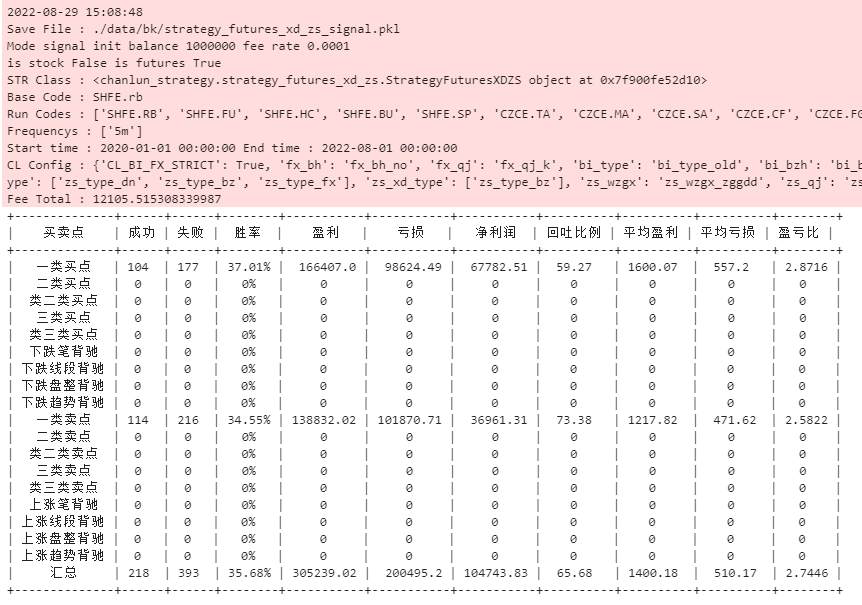
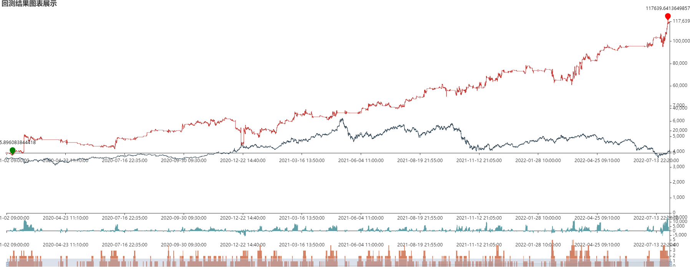
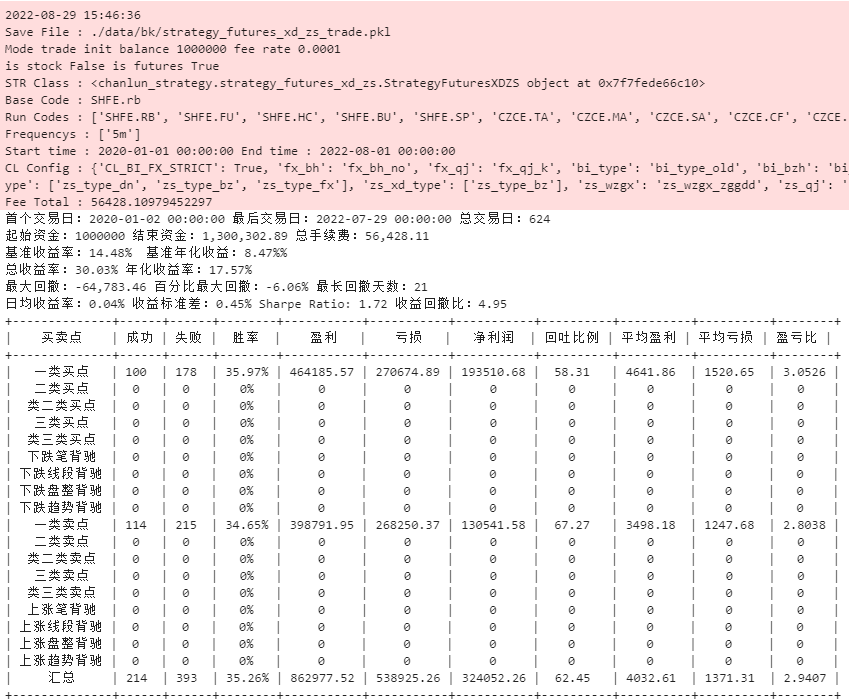
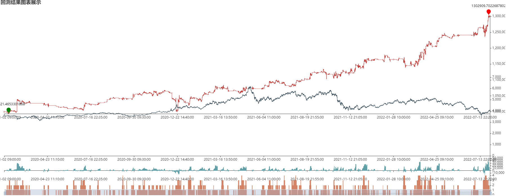

## 基于线段中枢震荡的策略

---

> 声明：回测结果不代表实盘运行效果，展示的策略示例只适合学习，不可直接用于实盘交易

策略文件：`src/chanlun/strategy/strategy_futures_xd_zs.py`

### 策略介绍

基于线段的中枢维持策略，在线段中枢上方做空，线段中枢下方做多。

#### 开仓策略：

    开仓策略严格一些，减少交易策略，尽量提升胜率与稳定性

    在线段中枢下方，当前价格小于中枢低点（ZD），向下线段完成，笔不创向下线段底特征序列分型第三特征的低点，买入做多
    在线段中枢上方，当前价格大于中枢高点（ZG），向上线段完成，笔不创向上线段顶特征序列分型第三特征的高点，卖出做空

#### 平仓策略：

    平仓条件适当宽松一些，可以用笔来判断
    1. 买入做多，向上线段完成，退出平仓
    2. 买入做空，向下线段完成，退出平仓
    3. 买入做多，价格大于中枢低点，向上笔出现盘整/趋势背驰，或者任意卖点，退出平仓
    4. 买入做空，价格小于中枢高点，向下笔出现盘整/趋势背驰，或者任意买点，退出平仓
    6. 买入做多，价格大于中枢高点，向上笔出现笔背驰，退出平仓
    6. 买入做空，价格小于中枢低点，向下笔出现笔背驰，退出平仓

### 策略回测结果

回测市场：`期货`

回测时间：`2020-01-01 / 2022-08-01`

回测周期：`5分钟`

回测标的：

    'SHFE.RB', 'SHFE.FU', 'SHFE.HC', 'SHFE.BU', 'SHFE.SP',
    'CZCE.TA', 'CZCE.MA', 'CZCE.SA', 'CZCE.CF', 'CZCE.FG', 'CZCE.RM', 'CZCE.SF', 'CZCE.SM', 'CZCE.AP',
    'DCE.V', 'DCE.P', 'DCE.Y', 'DCE.M', 'DCE.I', 'DCE.EG', 'DCE.PP', 'DCE.L', 'DCE.C', 'DCE.EB'

回测配置如下：

        bt_config = {
            # 策略结果保存的文件
            'save_file': './data/bk/strategy_futures_xd_zs_signal.pkl',
            # 设置策略对象
            'strategy': StrategyFuturesXDZS(),
            # 回测模式：signal 信号模式，固定金额开仓； trade 交易模式，按照实际金额开仓
            'mode': 'signal',
            # 市场配置，currency 数字货币  a 沪深  hk  港股  futures  期货
            'market': 'futures',
            # 基准代码，用于获取回测的时间列表
            'base_code': 'SHFE.rb',
            # 回测的标的代码
            'codes': [
                'SHFE.RB', 'SHFE.FU', 'SHFE.HC', 'SHFE.BU', 'SHFE.SP',
                'CZCE.TA', 'CZCE.MA', 'CZCE.SA', 'CZCE.CF', 'CZCE.FG', 'CZCE.RM', 'CZCE.SF', 'CZCE.SM', 'CZCE.AP',
                'DCE.V', 'DCE.P', 'DCE.Y', 'DCE.M', 'DCE.I', 'DCE.EG', 'DCE.PP', 'DCE.L', 'DCE.C', 'DCE.EB'
            ],
            # 回测的周期，这里设置里，在策略中才能取到对应周期的数据
            'frequencys': ['5m'],
            # 回测开始的时间
            'start_datetime': '2020-01-01 00:00:00',
            # 回测的结束时间
            'end_datetime': '2022-08-01 00:00:00',
            # mode 为 trade 生效，初始账户资金
            'init_balance': 1000000,
            # mode 为 trade 生效，交易手续费率
            'fee_rate': 0.0001,
            # mode 为 trade 生效，最大持仓数量（分仓）
            'max_pos': 4,
            # 缠论计算的配置，详见缠论配置说明
            'cl_config': {
                'CL_BI_FX_STRICT': True,
                'fx_bh': 'fx_bh_no', 'fx_qj': 'fx_qj_k',
                'bi_type': 'bi_type_old', 'bi_bzh': 'bi_bzh_yes', 'bi_qj': 'bi_qj_dd', 'bi_fx_cgd': 'bi_fx_cgd_no',
                'xd_bzh': 'xd_bzh_yes', 'zsd_bzh': 'zsd_bzh_yes', 'xd_qj': 'xd_qj_dd', 'zsd_qj': 'zsd_qj_dd',
                'zs_bi_type': ['zs_type_dn', 'zs_type_bz', 'zs_type_fx'], 'zs_xd_type': ['zs_type_bz'],
                'zs_wzgx': 'zs_wzgx_zggdd', 'zs_qj': 'zs_qj_ck'
            },
        }

#### 信号回测模式下，结果如下：

> 信号模式下，没有当前资金余额等数据，所有开仓指令，开仓金额固定为 10万 元，无期货杠杆倍数
> 
> 净盈利从 0 开始，经过每笔交易盈亏，进行累加后得出

#### 交易回测模式下，结果如下：

> 交易模式下，根据给定的初始资金 与 最大仓位数，决定每次开仓的金额
> 
> 例如初始资金 100万，最大开仓 4，每笔开仓金额为 100万 / 4 = 25万
> 
> 如后续盈利到 120万，当前已经有 2 笔持仓，占用资金 50万，余额 70万，后续一笔的开仓金额为 ：70 / (4 - 2) = 35万
> 
> 如当前持仓 RB/FU/HC/TA 四个仓位，已经达到设定的仓位数量，策略后续的开仓信号将会被忽略

