## 多中枢类型相同买卖点策略

---

> 声明：回测结果不代表实盘运行效果，展示的策略示例只适合学习，不可直接用于实盘交易

关于中枢的划分，每个人的画法都会有一些差异，程序也只是按照特定的规则进行划分，一些图表，人眼可以很直观的画出合理的中枢，程序则比较固定化，不一定画在最合理的地方；

目前程序中提供了三种中枢划分的标准，分别是 标准中枢、段内中枢、方向中枢；

> 标准中枢：按照中枢延申的规则，直到出现三类买卖点终结原中枢，才会生成新的中枢；
>
> 段内中枢：按照高一级别的线段，以线段的起始笔开始画中枢，直到新的线段产生；
>
> 方向中枢：所生成的中枢是有严格方向的（向上、向下）

**设想：如果当前笔在以上三种中枢类型都出现相同的买卖点，那买卖点的成功率是不是会比较大呢？**

接下来就用程序来进行验证。

策略文件：`src/chanlun/strategy/strategy_multiple_zs_mmds.py`

最新版本的缠论数据计算，支持同时计算多个中枢，并生成其中的买卖点；

只需要在缠论配置项指定 `zs_bi_type` 为所需要的中枢类型列表即可，如

        'zs_bi_type': ['zs_type_bz', 'zs_type_fx', 'zs_type_dn']

### 策略介绍

策略数据使用单周期；

开仓策略：所计算的中枢同时出现买卖点，并且买卖点对应的中枢，有会拉零轴的过程，并且当笔停顿则进行买进；

平仓策略：所计算的中枢，只有有其中一个中枢出现相反的买卖点或背驰就平仓退出；

需要注意的是在缠论计算配置中，将 `zs_bi_type` 设置为自己需要的中枢类型列表，在策略中，通过如下代码，获取所有中枢产生的买卖点合集：

        mmds = high_bi.line_mmds('&')
        # 如果不传递参数，返回的是第一个中枢类型的买卖点列表，也可以传递指定的中枢类型，如 zs_type_dn 获取段内中枢产生的买卖点
        # 也可以传递特殊的参数，如 &、|
        # & ：表示当前计算所有中枢类型产生的买卖点交集
        # | ：表示当前计算所有中枢类型产生的买卖点合集

策略增加一个简单过滤，需要产生买卖点的中枢有回拉零轴的过程，代码如下：

        # 增加条件，买卖点对应的中枢，需要回拉零轴
        for zs_type, mmds in high_bi.zs_type_mmds.items():
            for mmd in mmds:
                if self.judge_macd_back_zero(high_data, mmd.zs, high_bi) is False:
                    return opts

如果有产生买卖点，并且只要有一个买卖点对应的中枢没有回拉零轴的过程，就不产生交易。

平仓操作，判断只要有一个中枢类型产生了相反的买卖点，或者背驰，就在笔停顿的时候平仓。

判断所有中枢类型中是否有产生指定的买卖点和背驰，代码如下：

        high_bi.mmd_exists(['1sell', '2sell', '3sell', 'l3sell'], '|')
        high_bi.bc_exists(['bi', 'pz', 'qs'], '|')
        # 通过传递第二个参数为 |，获取所有计算的中枢类型产生的买卖点中，是否有给定的买卖点中的一个

### 策略回测结果

数据采用沪深A股，市值前 100 的股票，日线周期数据，时间从 2017-01-01 到 2022-06-01，5年半的时间。

回测配置如下：

        bt_config = {
            # 策略结果保存的文件
            'save_file': './data/bk/a_strategy_multiple_zs_mmds_trade_fx.pkl',
            # 设置策略对象
            'strategy': StrategyMultipleZsMMDS(),
            # 回测模式：signal 信号模式，固定金额开仓； trade 交易模式，按照实际金额开仓
            'mode': 'signal',
            # 市场配置，currency 数字货币  a 沪深  hk  港股  futures  期货
            'market': 'a',
            # 基准代码，用于获取回测的时间列表
            'base_code': 'SH.000001',
            # 回测的标的代码
            'codes': ["SH.600519", "SH.601398", "SH.601939", "SH.601288", "SH.601857", "SH.600036", "SH.601988", "SH.601318", "SZ.002594", "SH.601628", "SZ.000858", "SH.601088", "SH.600028", "SH.600900", "SH.601658", "SH.601166", "SZ.000333", "SZ.300760", "SH.601012", "SH.601328", "SH.603288", "SZ.002415", "SH.601888", "SH.600809", "SH.688981", "SZ.000568", "SZ.000001", "SZ.300059", "SH.603259", "SH.600030", "SH.601899", "SZ.002714", "SH.601668", "SH.600309", "SH.600690", "SH.600887", "SZ.002352", "SZ.002304", "SH.601919", "SZ.002142", "SH.600000", "SH.601998", "SH.601633", "SZ.000002", "SH.601816", "SH.600585", "SZ.002475", "SH.600048", "SH.601319", "SZ.000651", "SH.601601", "SZ.300015", "SH.600104", "SH.601138", "SH.600276", "SH.600436", "SH.600438", "SZ.002812", "SH.601995", "SH.601390", "SH.600406", "SH.601800", "SH.600188", "SH.601818", "SH.601066", "SH.600905", "SH.601225", "SH.600016", "SZ.000792", "SZ.300122", "SH.600346", "SZ.002460", "SH.600018", "SH.603392", "SZ.000725", "SH.601766", "SZ.003816", "SZ.002493", "SH.600031", "SH.600019", "SH.601111", "SH.601985", "SZ.002459", "SH.603501", "SH.601211", "SH.601238", "SZ.002129", "SH.601898", "SZ.300014", "SZ.002371", "SZ.002241", "SH.601688", "SZ.000776", "SZ.300498", "SZ.002271", "SH.600600", "SH.600837", "SZ.001979", "SH.601669", "SH.601009"],
            # 回测的周期，这里设置里，在策略中才能取到对应周期的数据
            'frequencys': ['d'],
            # 回测开始的时间
            'start_datetime': '2017-01-01 00:00:00',
            # 回测的结束时间
            'end_datetime': '2022-06-01 00:00:00',
            # 是否是股票，True 当日开仓不可平仓，False 当日开当日可平
            'is_stock': True,
            # 是否是期货，True 可做空，False 不可做空
            'is_futures': False,
            # mode 为 trade 生效，初始账户资金
            'init_balance': 1000000,
            # mode 为 trade 生效，交易手续费率
            'fee_rate': 0.001,
            # mode 为 trade 生效，最大持仓数量（分仓）
            'max_pos': 15,
            # 缠论计算的配置，详见缠论配置说明
            'cl_config':{
                'default': {
                    'fx_bh': 'fx_bh_yes', 'fx_qj': 'fx_qj_k', 
                    'bi_type': 'bi_type_old', 'bi_bzh': 'bi_bzh_yes', 'bi_qj': 'bi_qj_dd', 'bi_fx_cgd': 'bi_fx_cgd_no', 
                    'xd_bzh': 'xd_bzh_yes', 'zsd_bzh': 'zsd_bzh_yes', 'xd_qj': 'xd_qj_dd', 'zsd_qj': 'zsd_qj_dd',
                    'zs_bi_type': 'zs_type_fx', 'zs_xd_type': 'zs_type_dn', 
                    'zs_wzgx': 'zs_wzgx_zggdd', 'zs_qj': 'zs_qj_ck'
                }
            }
        }

#### 首先使用单个中枢类型进行信号模式回测，结果如下：

`'zs_bi_type': 'zs_type_fx'` 单方向中枢

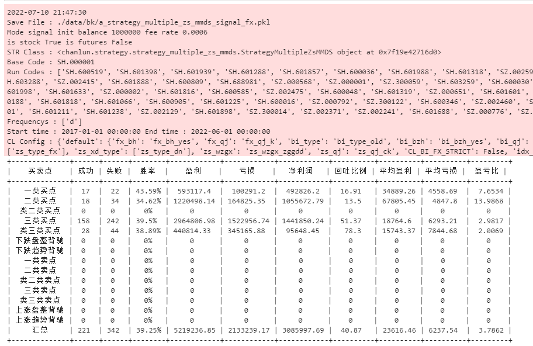

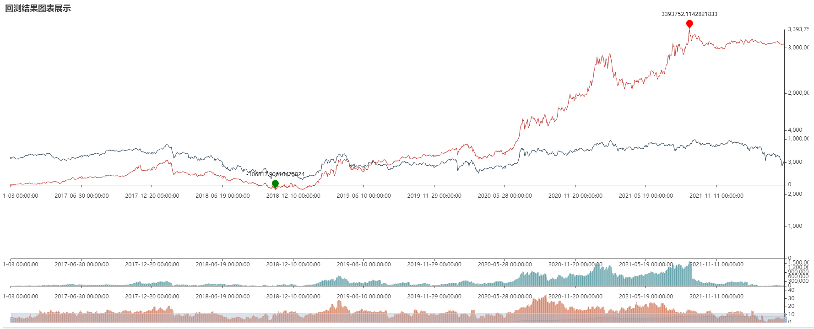

`'zs_bi_type': 'zs_type_dn'` 单段内中枢

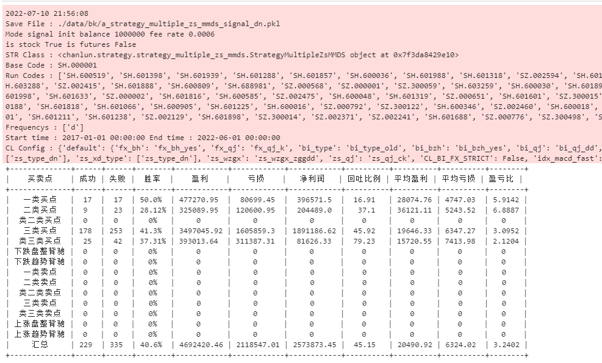

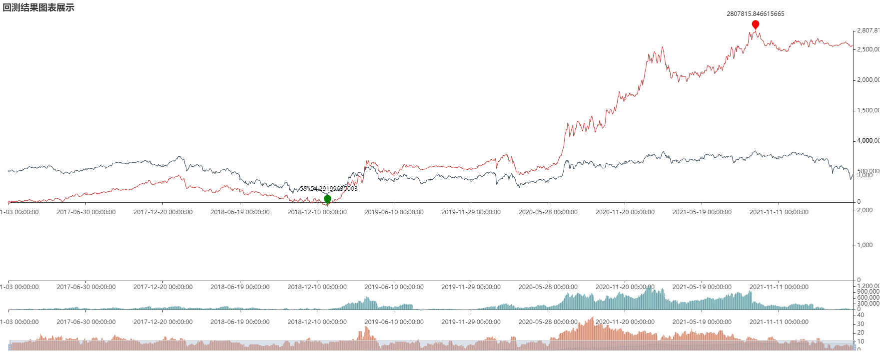

`'zs_bi_type': 'zs_type_bz'` 单标准中枢

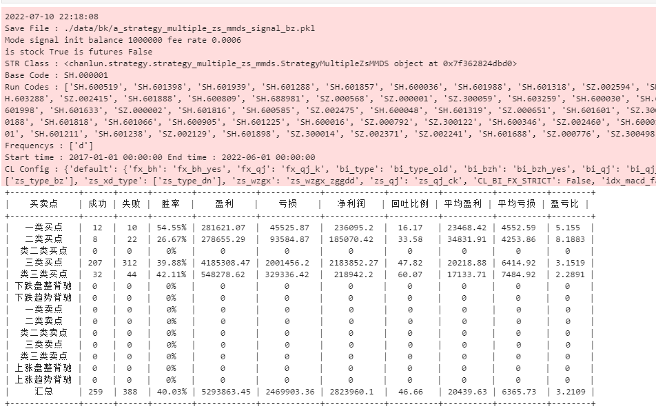

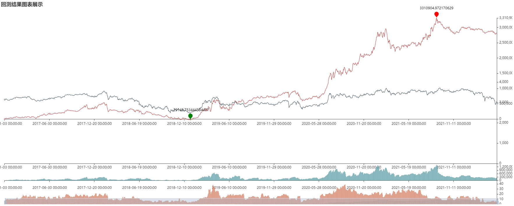

`'zs_bi_type': ['zs_type_bz', 'zs_type_fx', 'zs_type_dn']` 三中枢类型

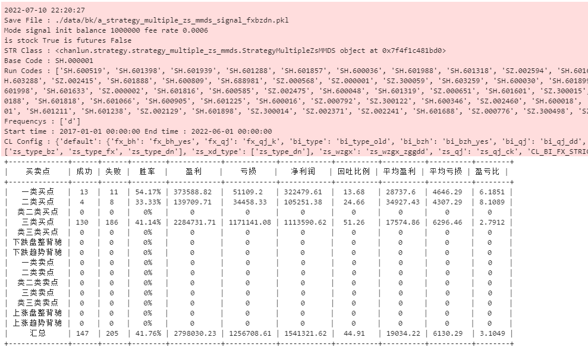

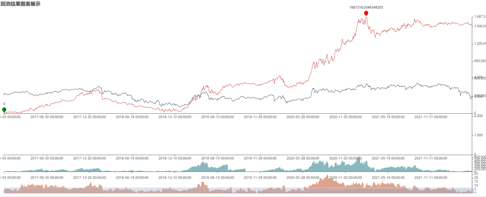

##### 总结

嗯。。。貌似交易量少了，胜率提升了一点点，其他的也没啥；

不过三类中枢买卖点，是唯一一个没有变为亏钱的策略，始终在 0 之上

| 中枢类型 | 总交易数 | 胜率 | 回吐比例 | 盈亏比 |
| ------- | ------ | ----- | ------ | ------|
| 方向中枢 | 563 | 39.25% | 40.87 | 3.7862 |
| 段内中枢 | 564 | 40.6% | 45.15 | 3.2402 |
| 标准中枢 | 647 | 40.3% | 46.66 | 3.2109 |
| 三类中枢 | 352 | 41.76% | 44.91 | 3.1049 |

#### 接下来进行交易模式回测，结果如下：

`'zs_bi_type': 'zs_type_fx'` 单方向中枢

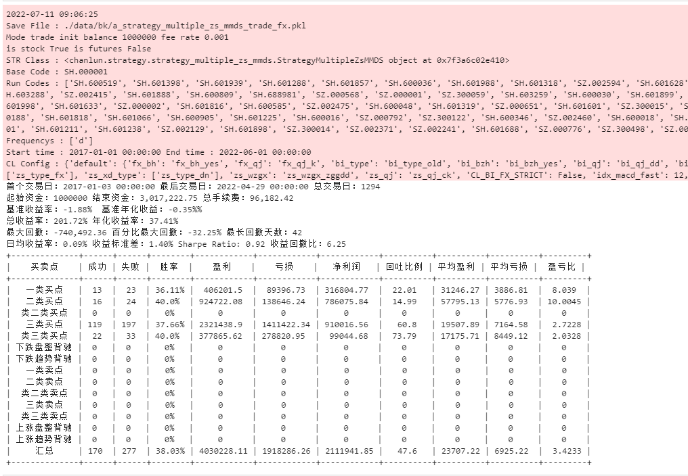

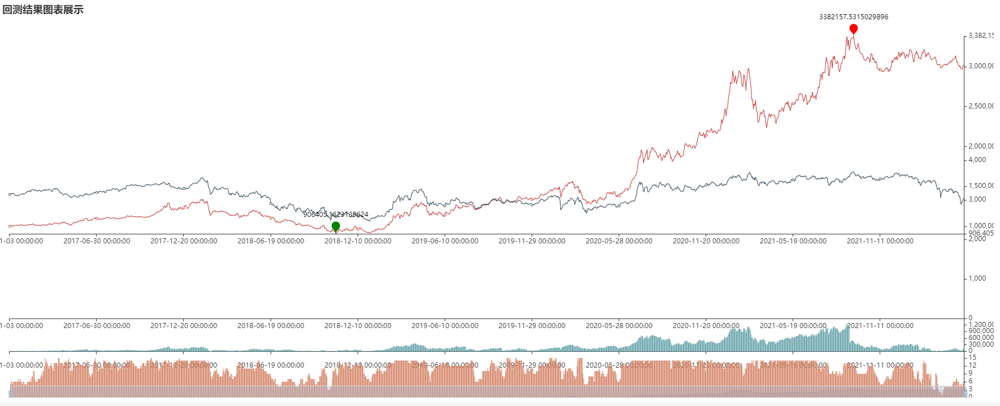

`'zs_bi_type': 'zs_type_dn'` 单段内中枢

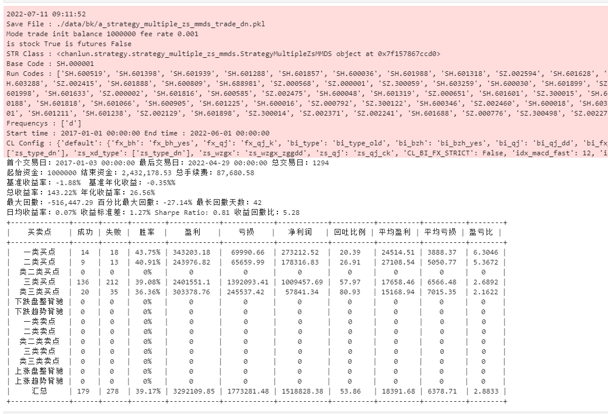

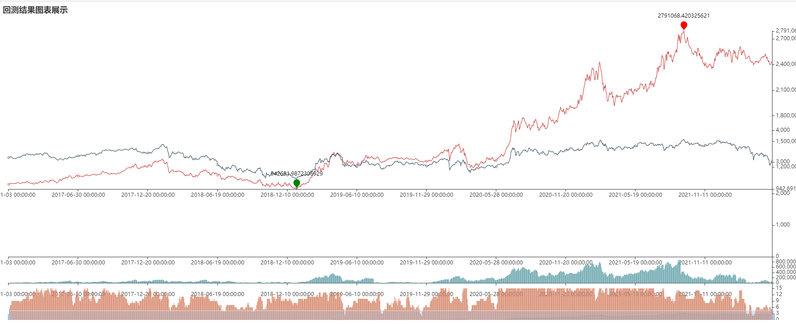

`'zs_bi_type': 'zs_type_bz'` 单标准中枢

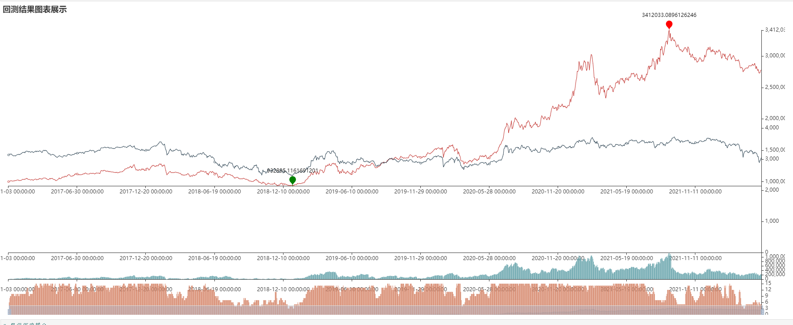

`'zs_bi_type': ['zs_type_bz', 'zs_type_fx', 'zs_type_dn']` 三中枢类型

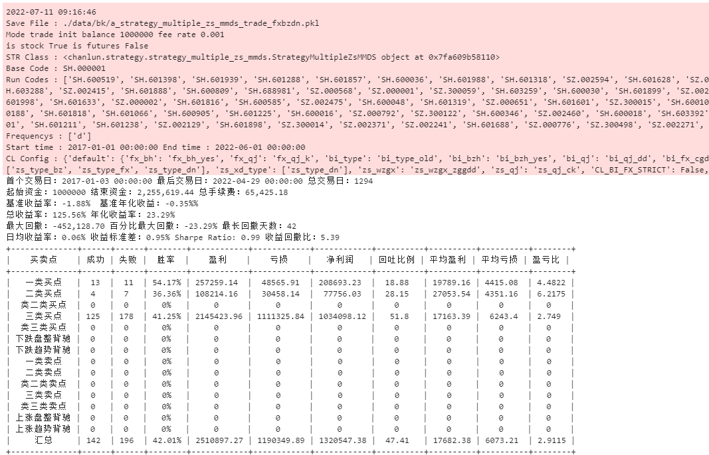

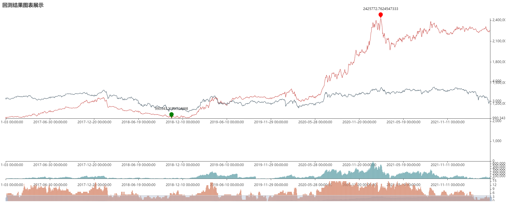

##### 总结

嗯。。。

| 中枢类型 | 总交易数 | 胜率 | 回吐比例 | 盈亏比 | 总收益 | 年化收益 | 回撤比例 | 收益回撤比 |
| ------- | ------ | ----- | ------ | ------| ----- | ------ | ------| ------|
| 方向中枢 | 447 | 38.03% | 47.6 | 3.4233 | 201.72% | 37.41% | -32.25% | 6.25 |
| 段内中枢 | 457 | 39.17% | 53.86 | 2.8833 | 143.22% | 26.56% | -27.14% | 5.28 |
| 标准中枢 | 455 | 40.22% | 50.6 | 2.9376 | 177.75% | 32.97% | -27.27% | 6.52 |
| 三类中枢 | 338 | 41.76% | 44.91 | 3.1049 | 125.56% | 23.29% | -23.29% | 5.39 |

#### Tips

展示图标中，默认展示的是第一个中枢类型的 中枢以及对应的买卖点，如果需要切换，可以传递画图参数配置进行更改，代码如下：

        BT.show_charts(code, BT.frequencys[0], chart_config={'custom_bi_zs_type': 'zs_type_bz'})

#### 声明

回测中使用的是当前市值前100的股票，并且A股只能做多，市值大也表示之前一段时间可能涨幅也比较大，回测看起来效果会比较好，换成其他股票结果就不一定了。

当前策略只能做到技术择时，实际应用中，还要根据自己的选股逻辑，做下基本面的选股，在结合择时会比较好。