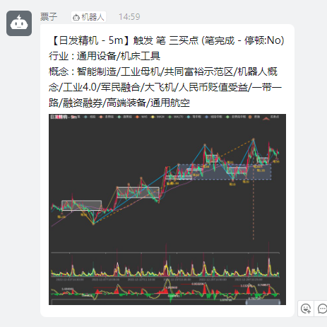

### 消息推送支持图片

---

### 默认安装后，推送的消息是不支持K线图片的，需要按照以下教程操作后，才可以支持

支持图片示例

> pyecharts 渲染图片文档 ：https://pyecharts.org/#/zh-cn/render_images
>
> 项目中使用的是 pyecharts + selenium 渲染图片的扩展
>
> 图片上传用的是 七牛云 服务： https://developer.qiniu.com/kodo/1242/python

### 1. 需要在 config.py 配置中，增加 七牛云 相关的配置

    QINIU_AK = '***'
    QINIU_SK = '***'
    QINIU_BUCKET_NAME = '空间名称'
    QINIU_PATH = '图片保存的路径'
    QINIU_URL = '图片访问的 url 域名地址'

### 2. pip 安装相关依赖

    pip install qiniu
    pip install snapshot-selenium

### 3. 安装 selenium 的 browser driver

> 官方文档：https://selenium-python.readthedocs.io/installation.html#drivers

#### Ubuntu 安装步骤

    # https://blog.csdn.net/weixin_45541986/article/details/125017752

    wget https://dl.google.com/linux/direct/google-chrome-stable_current_amd64.deb
    sudo dpkg -i --force-depends google-chrome-stable_current_amd64.deb
    sudo apt --fix-broken install
    sudo apt install libgtk2.0-0
    LATEST=$(wget -q -O - http://chromedriver.storage.googleapis.com/LATEST_RELEASE)
    wget http://chromedriver.storage.googleapis.com/$LATEST/chromedriver_linux64.zip
    unzip chromedriver_linux64.zip
    chmod +x chromedriver
    sudo mv chromedriver /usr/bin/

#### 4. 如上，程序可以正常渲染图片并上传到七牛云，即可在推送消息中增加图片