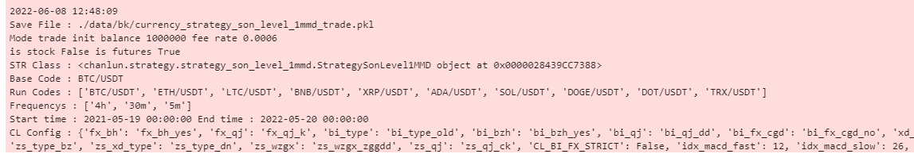
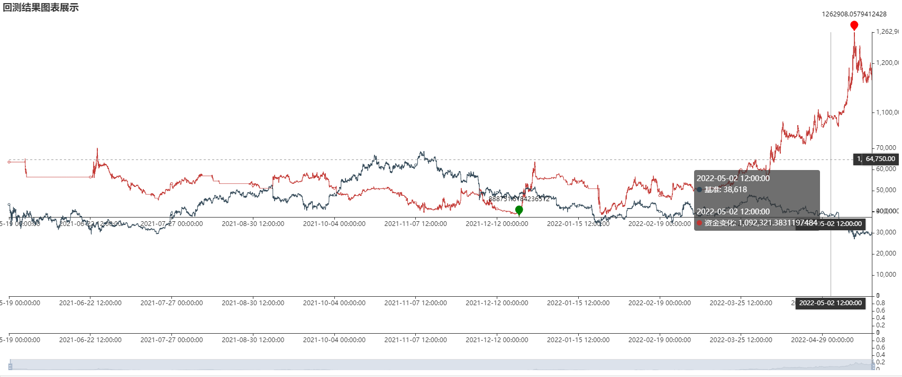
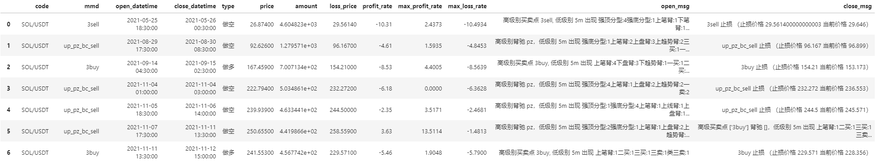
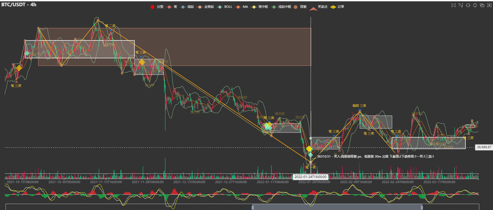

## 策略编写与运行

---

### [B站视频教程](https://space.bilibili.com/384267873)


> 不建议修改项目提供的策略、交易、自动化交易代码    
> 自己的策略、交易等代码，新建名称前缀为 my_ 的py文件，如 my_strategy_ma.py    
> 以 my_ 为前缀的文件，会被git忽略，不被添加到仓库中

> 回测策略前，请确保本地数据库已有回测标的周期的历史数据

### 回测简单逻辑

> `BackTestKlines` 加载回测K线数据，并自动处理低级别到高级别时间周期的合并
>
> `Strategy` 策略类，接收 缠论 数据，策略给出相应的 开仓、平仓信号（只给信号，不涉及资金仓位管理）
>
> `Trader` 交易类，按照 `Strategy` 给出的信号，执行相应的交易操作（这里可以根据实盘情况，进行分仓与资金管理）

### 目录结构

            -- notebook  # 回测执行目录
            ---- 回测_沪深股票策略.ipynb # 策略执行与结果查看
            -- src
            ----chanlun
            ------backtesting  # 回测框架目录
            -------- backtest.py  # 回测执行框架源码
            -------- backtest_klines.py  # 历史数据加载与回放源码
            -------- backtest_trade.py  # 回测交易执行源码
            -------- base.py  # 回测相关基础定义
            -------- optimize.py  # 参数优化
            ------strategy   # 策略文件目录
            ------ strategy_bc.py  # 具体点策略源码

### 策略编写

策略需要继承 `Strategy` 类，并需要实现两个方法 `open` 、`close`

            from chanlun.backtesting.base import *
            class MyStrategy(Strategy):    
                def __init__():
                    pass
                
                def open(self, code, market_data: MarketDatas, poss: Dict[str, POSITION]) -> List[Operation]:
                    pass

                def close(self, code, mmd: str, pos: POSITION, market_data: MarketDatas) -> [Operation, None, List[Operation]]:
                    pass

> `open`：接受缠论数据对象，判断并给出开仓信号
>
> `close`：接受缠论与持仓对象，判断并给出平仓信号

`MarketDatas` 是根据在回测或实盘中设置的周期列表来获取对应周期的数据的，如 回测中设置 frequencys = ['30m', '5m']

在策略中获取 30m 周期数据 使用 market_data.get_cl_data(code, market_data.frequencys[0])

5m 周期数据使用 market_data.get_cl_data(code, market_data.frequencys[1])

这样设计的好处是，如改变回测的周期，如 ['d', '30m']，则不用在修改策略中的代码

还有一点需要注意的是，CLDatas 类有类似懒加载的机制，如果不显示获取指定下标（周期）的数据，则不会进行缠论计算（用来节省回测时间）

举例：周期设置 ['30m', '5m'] ，策略根据 30m 周期买卖点操作，如果有买卖点，在看 5m 周期来确定买卖点成功概率，可以这样写：


```

# 这里获取 30m 缠论30m 周期的数据会计算，但是 5m 周期的数据并不会进行缠论计算
cd_30m = market_data.get_cl_data(code, market_data.frequencys[0])  

# 获取最后一笔
bi = cd_30m.get_bis()[-1]  

# 判断笔是否有买卖点，没有则直接返回，则不用获取 5m 数据
if len(bi.line_mmds()) == 0:  
    return []

# 有 30m 买卖点，在获取 5m 数据，用于后续的判断，则可以省掉一些计算花费
cd_5m = market_data.get_cl_data(code, market_data.frequencys[1])  

```

### 策略执行

策略运行，在 Jupyterlab 中编写并运行，可以方便查看回测进度与结果

示例参考：`notebook/回测_沪深股票策略.ipynb`

定义回测配置，具体格式与含义如下：

> frequencys 设置周期要从大到小，如： 'd', '30m', '5m'，不可以是  '5m', '30m', 'd'

```

bt_config = {
        # 策略结果保存的文件
        'save_file': './data/bk/currency_strategy_demo.pkl',
        # 设置策略对象
        'strategy': strategy_demo.StrategyDemo(),
        # 回测模式：signal 信号模式，固定金额开仓； trade 交易模式，按照实际金额开仓
        'mode': 'trade',
        # 市场配置，currency 数字货币  a 沪深  hk  港股  futures  期货
        'market': 'currency',
        # 基准代码，用于获取回测的时间列表
        'base_code': 'BCH/USDT',
        # 回测的标的代码
        'codes': ['BCH/USDT', 'EOS/USDT'],
        # 回测的周期，这里设置里，在策略中才能取到对应周期的数据
        'frequencys': ['30m', '5m'],
        # 回测开始的时间
        'start_datetime': '2022-02-01 00:00:00',
        # 回测的结束时间
        'end_datetime': '2022-04-01 00:00:00',
        # mode 为 trade 生效，初始账户资金
        'init_balance': 1000000,
        # mode 为 trade 生效，交易手续费率
        'fee_rate': 0.0006,
        # mode 为 trade 生效，最大持仓数量（分仓）
        'max_pos': 3,
        # 缠论计算的配置，详见缠论配置说明
        'cl_config': {'xd_bzh': 'xd_bzh_no'},
    }

```

创建 `BackTest` 类，并传递 回测配置，调用 `run()` 方法执行回测，`save()` 方法将回测结果落地到文件

```

BT = backtest.BackTest(bt_config)
# 运行回测，可传递回测每次循环的周期，默认为 frequencys 设置的 最后一个周期
BT.run('30m')
# 保存回测结果到文件中
BT.save()
```

### BackTest 中方法

`info()` 输出回测相关配置信息



`result()` 输出回测结果信息


`backtest_charts()` 输出回测结果信息



`positions()` 返回历史持仓信息



`show_charts()` 输出指定标的周期的行情图表




