## 缠论买卖点和背驰规则

---

* 背驰的比较方法
* _力度的比较，向上段取 MACD 红柱子之和，向下段取 MACD 绿柱子之和_
* 参考 `cl_interface.py` 文件中的 `query_macd_ld` 、 `compare_ld_beichi` 方法，可修改成自己的力度计算与比较规则

---

* 自定义买卖点方法
* 参考 `cl_interface.py` 文件中的 `user_custom_mmd`，在其后增加自己的买卖点规则

---

> 判断两中枢是否是趋势，根据缠论的配置 （中枢位置关系（zs_wzgx））而不同
>
> 宽松比较(zg/zd)：两个中枢的 zg、zd 进行比较，无重叠则为趋势
>
> 较为宽松(zg/dd zd/gg) ：当前中枢的 zg/zd 与上一个中枢的 gg/dd 进行比较，无重叠则为趋势
>
> 严格比较(gg/dd)：两个中枢的 gg、dd 进行比较，无重叠则为趋势

### 第一类买点

1. 两中枢（级别相同）趋势背驰一买

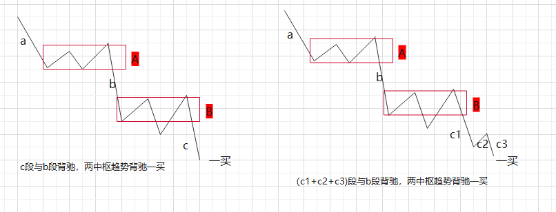

2. 三卖后背驰一买（三卖对应的中枢是下跌中枢）

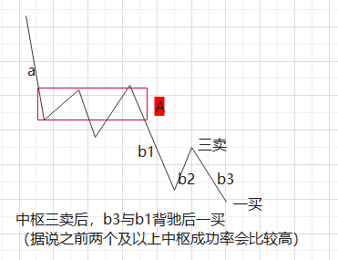

### 第一类卖点

1. 两中枢（级别相同）趋势背驰一卖
2. 三买后背驰一卖（三买对应的中枢是上涨中枢）

* _图参考第一类买点的，反过来看即可_

### 第二类买点

1. 两中枢趋势后，创新低后，后续段不创新低二买
2. 两中枢趋势后，不创新低，段背驰二买

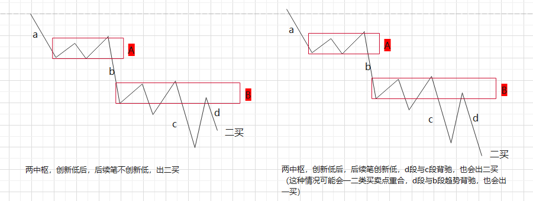

3. 一类买点后，不创新低二买 （新增规则，三卖后不产生一买，后续不创新低也会出现二买）

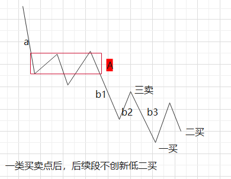

### 第二类卖点

1. 两中枢趋势后，创新高后，后续段不创新高二卖
2. 两中枢趋势后，不创新高，段背驰二卖
3. 一类卖点后，不创新高二卖（新增规则，三买后不产生一卖，后续不创新高也会出现二卖）

* _图参考第二类买点的，反过来看即可_

### 类第二类买点

如果前一同向的线段出现二类买点，当前与二类买点笔有重叠（形成中枢），线段的低点大于二买的低点，标记二类买点

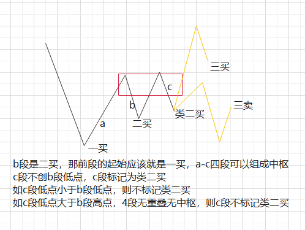

### 类第二类卖点

如果前一同向的线段出现二类卖点，当前与二类卖点笔有重叠（形成中枢），线段的高点小于二卖的高点，标记二类卖点

* _图参考类第二类买点的，反过来看即可_

### 第三类买点

向上线段离开中枢，后续向下线段不回中枢的，都定义为三类买点

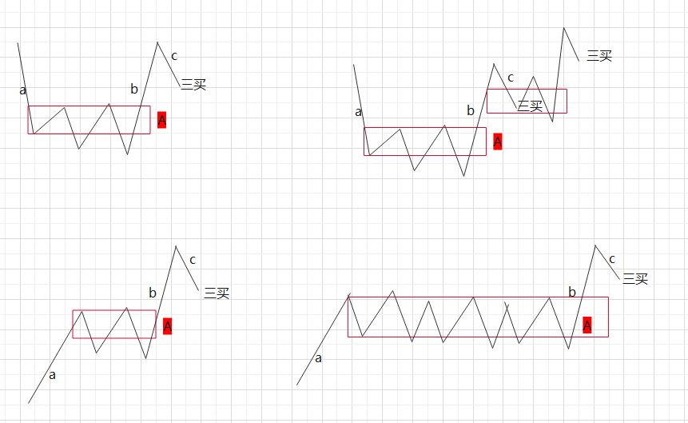

### 第三类卖点

向下线段离开中枢，后续向上线段不回中枢的，都定义为三类卖点

* _图参考第三类买点的，反过来看即可_

### 类第三类买点

如果前一同向的线段出现三类买点，当前与三类买点笔有重叠（形成中枢），线段的低点大于三买的低点，标记三类买点

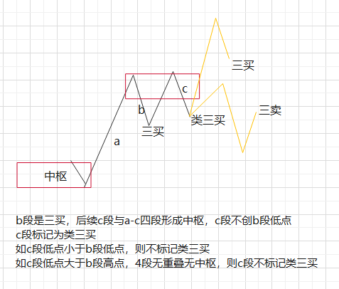

### 类第三类卖点

如果前一同向的线段出现三类卖点，当前与三类卖点笔有重叠（形成中枢），线段的高点小于三卖的高点，标记三类卖点

* _图参考类第三类买点的，反过来看即可_

------

### 背驰，笔/段/走势段背驰

三段，第三段创新高或新低，并且力度比第一段要小

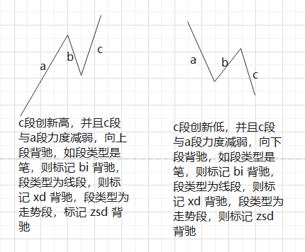

### 背驰，盘整背驰

存在中枢，并且中枢进入段是最高或最低的，离开段是最高或最低的，离开段与进入段力度减弱，标记盘整背驰

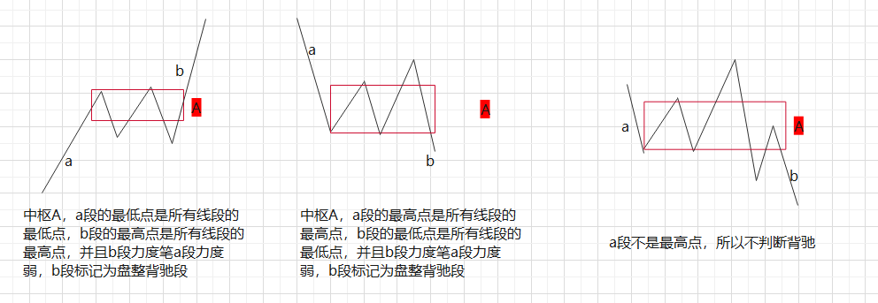

### 背驰，趋势背驰

两个及以上同方向同级别的中枢，中枢无重叠，并且最后段创新高或新低，力度比较前段弱，标记为趋势背驰

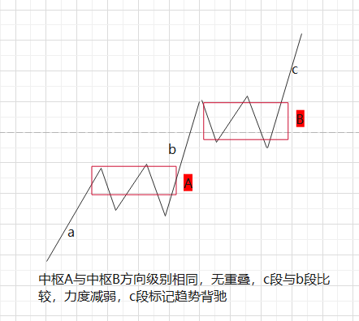

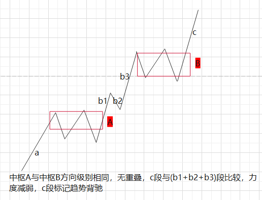

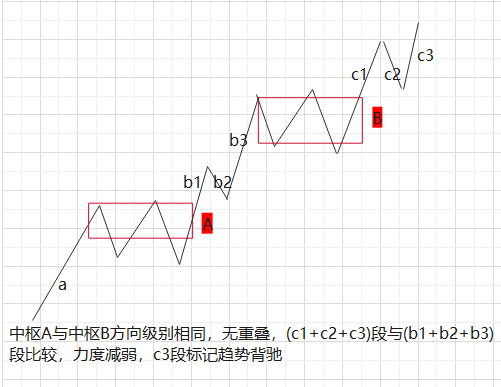