## 缠论配置项说明

---

### K线类型 (kline_type)

* 默认K线 （kline_default）
* 缠论K线 （kline_chanlun）

> 缠论K线，图表与指标计算使用包含处理后的缠论K线

### 分型高低区域

* 分型三根K线（fx_qy_three）
* 分型中间K线（fx_qy_middle）

> 分型三根K线：在获取分型高点时，取构成分型三根缠论K线的高低点
>
> 分型中间K线：在获取分型高点时，只获取构成分型中间（第二根）缠论K线的高低点
>
> 设置会影响处理分型包含关系的判断，影响笔的计算

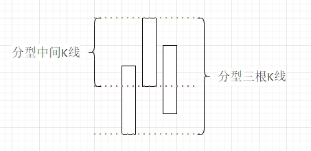

### 分型区间 （fx_qj）

* 分型内原始K线高低区间（fx_qj_k）
* 分型内缠论K线高低区间（fx_qj_ck）

> 会影响后续笔、线段、中枢等的高点和低点值的获取

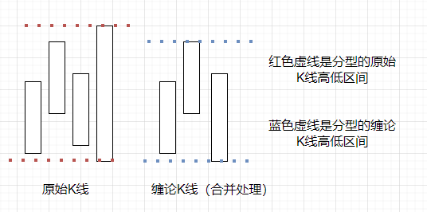

### 分型包含关系（fx_bh）

* 接受所有包含关系（fx_bh_yes）
* 不允许所有包含关系（fx_bh_no）
* 顶不可以在底中（fx_bh_dingdi）
* 底不可以在顶中（fx_bh_diding）
* 不允许前分型包含后分型（fx_bh_no_qbh）
* 不允许后分型包含前分型（fx_bh_no_hbq）
* 不允许顶底有重叠（fx_cd_no)

> 影响笔的计算方式

> 影响笔的计算方式

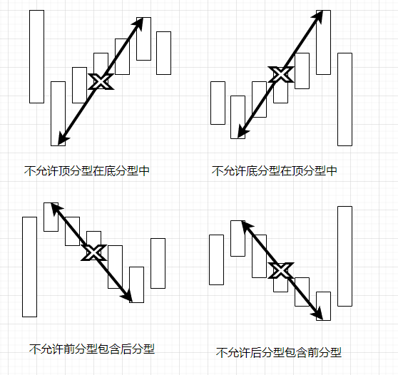

### 笔类型（bi_type）

* 老笔（bi_type_old）
* 新笔（bi_type_new）
* 简单笔（bi_type_jdb）
* 顶底成笔（bi_type_dd）

> 老笔：顶底分型不能共用缠论K线，并且分型之间至少有一根独立的缠论K线
>
> 新笔：顶底分型不能共用缠论K线，并且分型之间至少有5跟原始K线
>
> 简单笔：顶底分型，至少5跟原始K线，即可成笔
>
> 顶底成笔：只要出现顶底分型，就可成笔

### 笔标准化（bi_bzh）

* 笔标准化（bi_bhz_yes）
* 笔不标准化（bi_bhz_no）

> 标准化，将笔画在实际的高低点，影响笔的计算方式

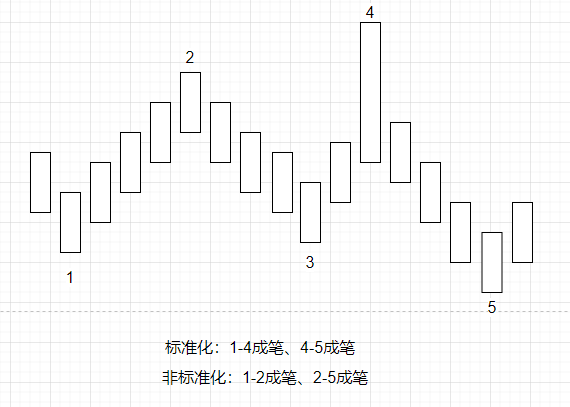

### 笔区间（bi_qj）

* 笔的起始端点（bi_qj_dd）
* 笔内原始K线最高最低（bi_qj_k）
* 笔内缠论K线最高最低（bi_qj_ck）

> 计算线段时，用到笔计算特征序列，笔的高低点根据这里设置获取，会影响到线段的特征序列，从而影响到线段的计算

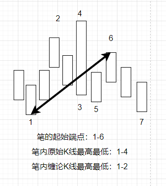

### 次高底分型（bi_fx_cgd）

* 允许次高低分型成笔（bi_fx_cgd_yes）
* 不允许次高低分型成笔（bi_fx_cgd_no）

> 影响笔的计算方式

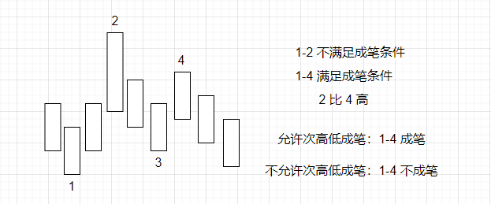

### 笔重叠K，笔内重叠K线拆分

> 一笔内部，如果有n跟K线重叠，则进行拆分（拆分后也需要满足特定条件，比如至少3K等）
>
> 配置示例：20,2
>
> 20 指重叠的K线数量，2 表示中间允许有2跟K线不连续重叠
>
> 重叠最小k线数量 13, 99 则表示不启用，最大不连续重叠设置区间 0-5

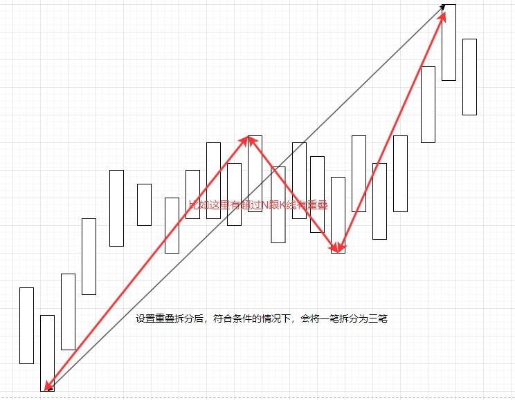

### 笔检查K

> 超过给定值后，不去验证是否成笔的条件，比如不允许次高低成笔/分型是否包含等条件

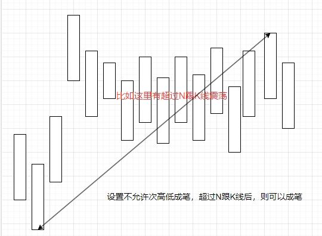

### 分型严格处理

> 分型是否严格处理
>
> 关闭：不严格处理，允许顶的最低点低于底分型最低点，允许底分型的最高点高于顶分型的最高点
>
> 开启：严格处理，不允许顶的最低点低于底分型最低点，不允许底分型的最高点高于顶分型的最高点

### 线段区间（xd_qj）

* 线段的起始端点（xd_qj_dd）
* 线段内缠论K线高低点（xd_qj_ck）
* 线段内原始K线高低点（xd_qj_k）

> 同笔区间

### 走势段区间（zsd_qj）

* 线段的起始端点（zsd_qj_dd）
* 线段内缠论K线高低点（zsd_qj_ck）
* 线段内原始K线高低点（zsd_qj_k）

> 同笔/线段区间

## 项目中的线段划分采用特征序列的方式进行，个别情况划分的并不理想，以下设置就针对于个别情况进行特殊处理

> 标准的特征序列划分

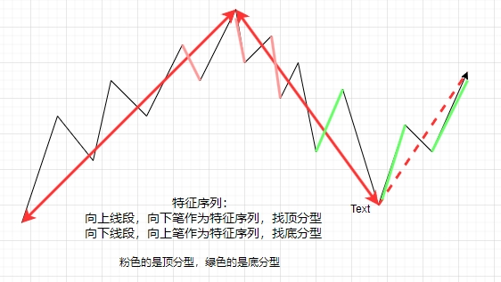

# 线段划分：笔破坏
 
> 可以设置 不允许/允许/允许（有缺口）       
> 允许（有缺口），仅当破坏的笔中有跳空缺口的时候才可以     

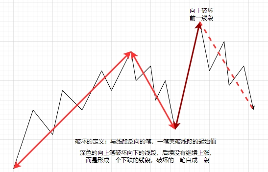

# 线段划分：非标准

> 以特征序列标准划分线段，起始或结束并非线段组成线段的最高或最低，进行拆分        
> (* 组成线段的笔必须大于等于9笔才可以)     

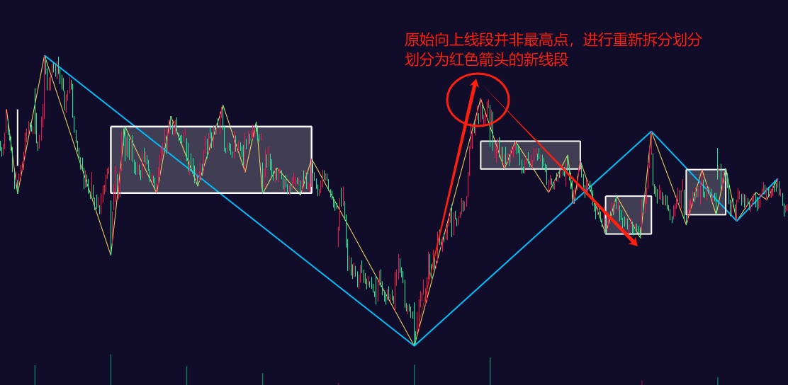

# 线段划分：中枢扩展

> 线段内部的中枢，有相连的两个中枢重叠（扩展），进行线段拆分     
> 为了照顾级别，如果两个中枢重叠了，认为级别上升了，所以进行拆分    

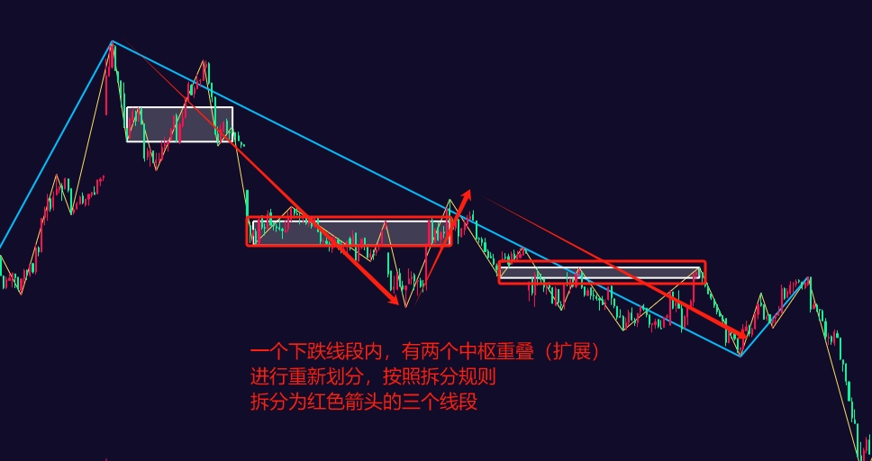

# 线段划分：中枢不同

> 线段内部的中枢，有与线段相反的中枢，进行线段拆分

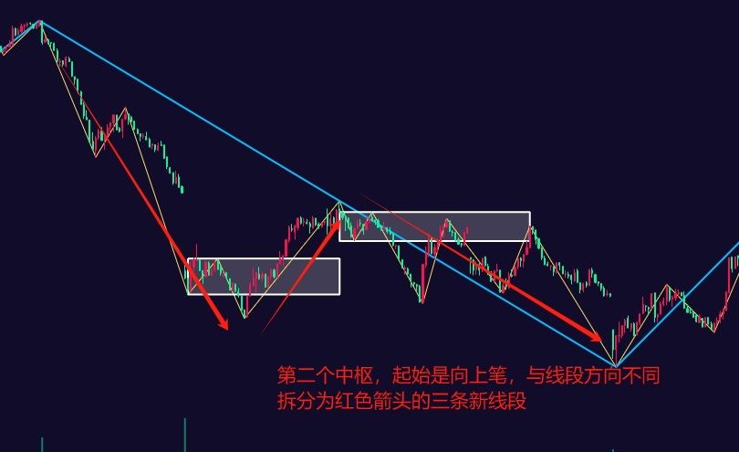

### 线段划分：中枢多段

> 线段内所形成的中枢超过 N 段后，进行拆分（N段数量包括进入与离开段）      
>
> 为了照顾级别，如果线段内的中枢超过 9 段，意味着级别进行了生长，将线段拆分三段，形成三段中枢，来展示级别的生长

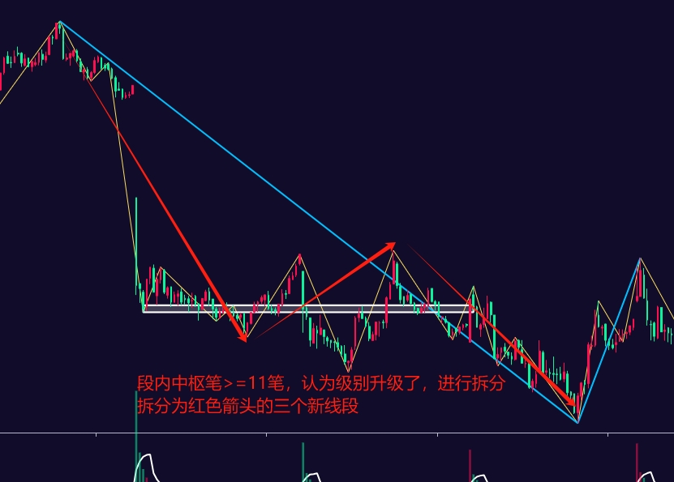

### 线段划分：中枢最大笔

> 设置段内中枢大于等于几笔，才认为级别上升，最小设置为 9       
> 当“中枢多段”设置后，才生效    

### 笔中枢类型（zs_bi_type） / 线段中枢（zs_xd_type）

* 标准中枢（zs_type_bz）
* 段内中枢（zs_type_dn）
* 方向中枢（zs_type_fx）
* 分类中枢（zs_type_fl）

> 买卖点根据中枢来进行计算，会影响到买卖点的出现位置
>
> 标准中枢：中枢会根据前三笔重合区间，一直延续，直到出现三类买卖点结束
>
> 段内中枢：在新的线段出现前，同标准中枢，如出现新的线段，从线段的起始位置，重新计算新的中枢
>
> 方向中枢：中枢的进入段与离开段方向一致，并且进入与离开段的起始与结束是中枢线中最高和最低点
>
> 分类中枢：标准中枢与段内中枢的结合，区别在新段开始后，前一线段内的中枢可继续延续，直到超9段或出三类买卖点后结束

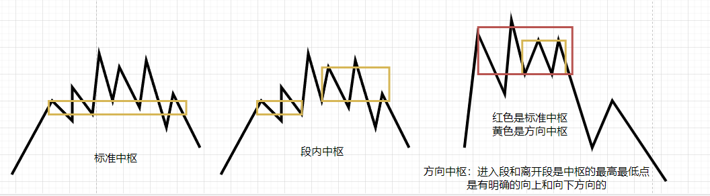

### 中枢区间（zs_qj）

* 中枢元素的顶底端点（zs_qj_dd）
* 中枢元素的缠论K线高低点（zs_qj_ck）
* 中枢元素的原始K线高低点（zs_qj_k）

> 计算中枢 zg/zd/gg/dd （中枢高点、中枢低点）的依据
>
> 会影响中枢趋势计算（两中枢不可重叠，形成趋势）

### 中枢位置关系（zs_wzgx）

* 宽松比较(zg/zd) （zs_wzgx_zgd）
* 较为宽松(zg/dd zd/gg) （zs_wzgx_zggdd）
* 严格比较(gg/dd) （zs_wzgx_gd）

> 判断两个中枢是否有重复，以此判断是否形成趋势，影响趋势计算
>
> 宽松比较(zg/zd)：两个中枢的 zg、zd 进行比较
>
> 较为宽松(zg/dd zd/gg) ：当前中枢的 zg/zd 与上一个中枢的 gg/dd 进行比较
>
> 严格比较(gg/dd)：两个中枢的 gg、dd 进行比较

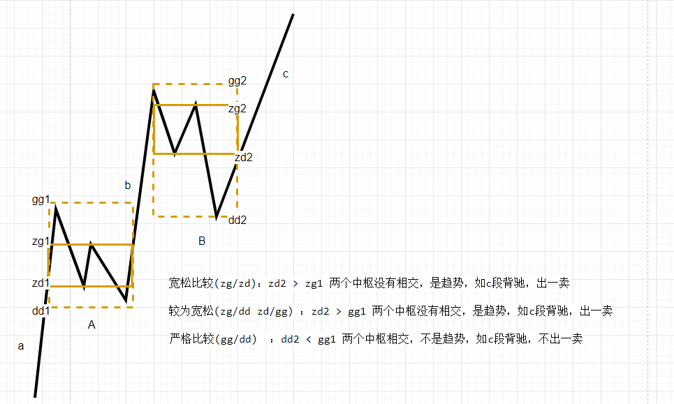

### 低转高级别

> 是否开启低级别数据转高级别图表展示功能（不影响缠论计算，只在画图段体现变化，建议将 笔和中枢 隐藏掉）
>
> 高级别对应的低级别对照关系在 cl_utils.py kcharts_to_new_frequency 方法中，可自行按需求更改
>
> 因为数据服务提供差异，级别不要设置太小，太小转高级别就没有多少数据了
>
> 其中的对应关系倍数也不固定，基本在 3-8 区间内，也会因为数据提供API限制不会找到符合要求的低级别周期
>
> 低级别转高级别方法在 chanlun.exchange.exchange.py convert_***_kline_frequency，也需要有对应的周期转换配置
>
> 自己根据实际情况，根据经验自行设置

