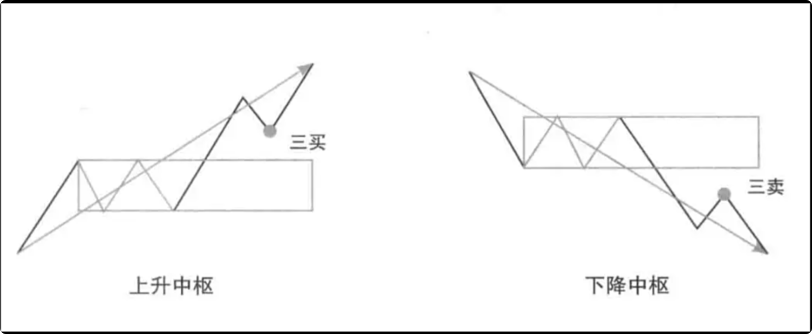
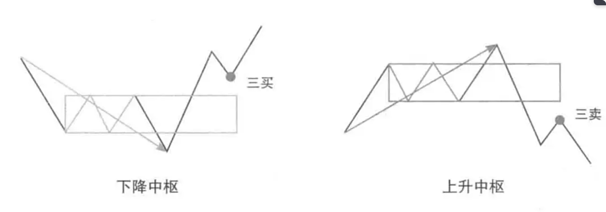
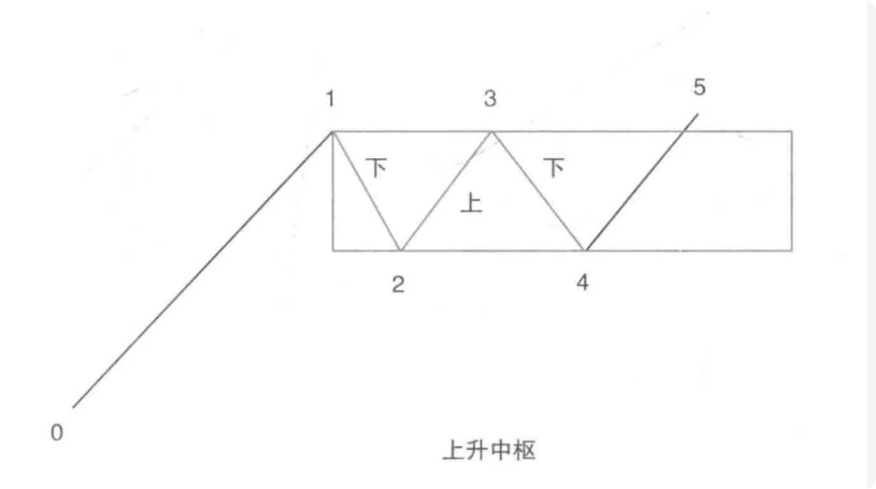
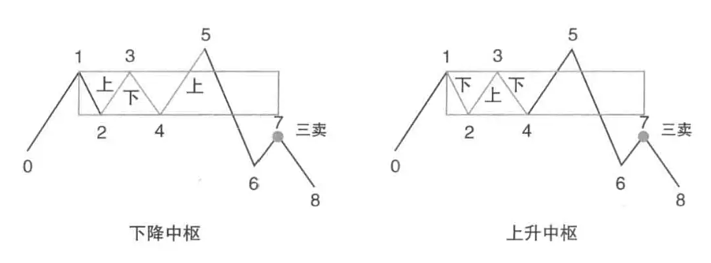

相比前面讲过的K线、笔和线段，中枢的第一个难点就是方向不好确认。

当中枢还没有形成第三类买卖点时，中枢的方向处于暂定的状态，这时候我们可以用进入段来定义中枢的方向。例如：走势的进入段是向上的，那就去找下上下的三个线段重叠来构筑生成中的中枢。

当中枢构筑完成后，会出现第三类买卖点，（关于第三类买卖点的概念将在后面详述），这时候的方向就以第三类买卖点来定义。

从本质上来说，中枢是一个整理期，是没有方向的。但我们为了配合实操中的运用，在中枢的形成中我们会用进入段来定义中枢的方向；当其完成后，就用第三类买卖点来定义中枢的方向，中枢的方向是什么，就代表走势即将朝着这个方向发展。出现第三类买点意味着走势即将向上发展，出现第三类卖点意味着走势即将向下发展。

因此，中枢的方向和其所在走势的方向是一致的，而不同方向的中枢，其组件也是不同的，看下图：

看下图：

当0-5还没有出现第三类买卖点前，可以暂时用进入段0-1来定义中枢的方向。0-1是向上的，那这个中枢就暂时定为向上的方向，中枢由1-2，2-3，3-4这个下上下来构筑。

看下图：

当它向下出现7这个第三类卖点时，这个中枢的方向就要重新确定了。如果把1-8看成一个走势，那这个中枢就是下降中枢，中枢是由2-3，3-4，4-5这个上下上来构筑的。也可以将0-5看成一个走势，5-8看成新的走势，那这个中枢就是上升中枢，这时中枢是由1-2，2-3，3-4这个下上下来构筑的。上图中的7，就是我们后面要讲到的第二、三类买卖点的重合。

不过，无论如何划分，中枢的区间都没有发生变化。即使我们赋予中枢的方向可能会改变，中枢的构筑也会改变，但中枢的区间始终是由前三段来定义的，基本上不会发生变化。

关于中枢在不同阶段，有不同的逻辑构建和归属的问题，我们在后面讲“结合律”的时候会再做详细的探讨。

实操中，我们会发现，除了有线段中枢外，还有笔中枢，这个我们在下节就会讲到。