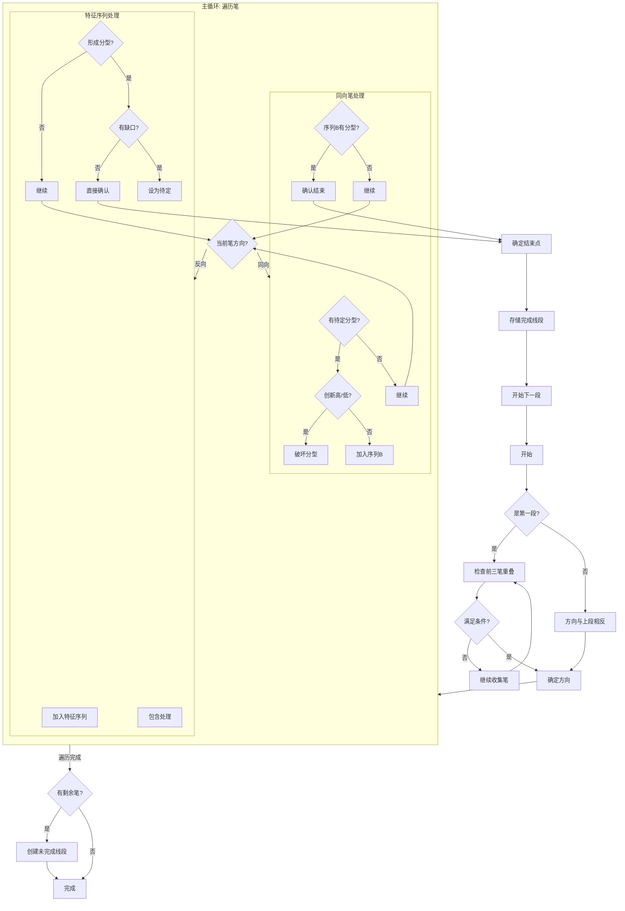
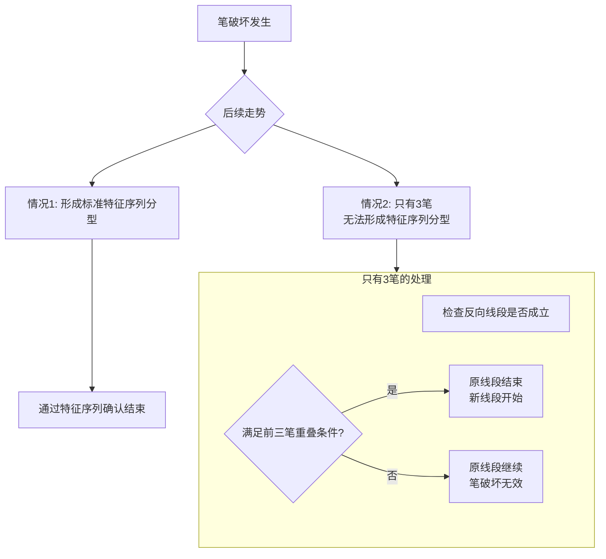

抱歉，Mermaid图表太复杂导致渲染失败。我将提供一个更简洁清晰的版本：



## 文字版完整算法流程

### 一、初始化
```
if 是第一段线段:
    if 前三笔有重叠:
        方向 = 第一笔方向
        起点 = 第一笔起点
    else:
        继续等待更多笔
else:
    方向 = 与上一线段相反
    起点 = 上一线段终点
```

### 二、主循环（处理每一笔）
```
for 每一笔 in 笔列表:
    if 当前笔方向 == 线段方向:
        # 同向笔处理
        if 有待定缺口分型:
            if 当前笔创新高/新低:
                破坏待定分型
            else:
                加入序列B
                if 序列B形成反向分型:
                    确认线段结束
    else:
        # 特征序列处理（反向笔）
        加入特征序列
        进行包含处理
        if 特征序列形成分型:
            if 分型有缺口:
                设为待定分型
                开始收集序列B
            else:
                直接确认线段结束
```

### 三、包含处理规则
```
if 向上线段:
    特征序列 = 所有向下笔
    包含处理取"高高"
    
if 向下线段:
    特征序列 = 所有向上笔
    包含处理取"低低"
    
# 包含要传递处理
while 还有包含关系:
    合并处理
```

### 四、确定结束点
```
if 确认线段结束:
    找到分型极值元素
    回溯到对应原始笔
    线段终点 = 该笔起点（或极值点）
    标记线段为完成
```

### 五、未完成线段
```
if 遍历结束仍有剩余笔:
    创建未完成线段
    标记 done = false
    在后续走势中更新
```

### 六、特殊情况
1. **笔破坏**：一笔直接突破前线段极值，需要至少三笔确认
2. **包含传递**：合并后可能继续与后续元素包含
3. **第一段确认**：必须前三笔有重叠才有效

### 七、笔破坏后下一线段如何判定结束
我有个疑问，笔破坏后，下一段大于3笔可以走特征序列判断结束，只有3笔无法通过特征序列判断，如何处理

你的问题非常好！这是缠论线段划分中的一个**关键难点**。让我详细解释：

## 📌 **核心问题**
当出现“笔破坏”后，如果只有**三笔**（原方向1笔 + 反向2笔），特征序列无法形成标准分型，此时如何处理？

## 🎯 **缠论原文规则**

### 1. **笔破坏的定义**
```
原线段：A→B→C（假设向上线段）
出现一笔D直接跌破B的低点 → 这就是“笔破坏”
```

### 2. **确认线段结束的条件**
缠论规定：**笔破坏后，必须至少有后续的3笔才能确认原线段结束**。

但这3笔有两种情况：



## 🔧 **具体算法实现**

### **情况1：有足够笔数（≥4笔）**
```
向上线段被笔破坏后走势：
D（向下笔，破坏）
E（向上笔）
F（向下笔）
G（向上笔）
...（更多笔）

→ 可以形成特征序列分型，正常判断
```

### **情况2：只有3笔（关键！）**
```
向上线段被笔破坏后：
D（向下笔，破坏）
E（向上笔）
F（向下笔，结束）
总共只有3笔！
```

**算法步骤：**
```python
def handle_pen_break_3bi_case():
    # 假设原线段是向上，被向下笔破坏
    
    1. 检查这三笔是否有重叠：
       三笔范围：D、E、F
       if max(D.low, E.low, F.low) <= min(D.high, E.high, F.high):
           # 有重叠，可以形成新线段
           原线段在D起点结束
           新线段（向下）从D起点开始
       else:
           # 无重叠，笔破坏无效
           原线段继续，忽略这次笔破坏
```

## 📊 **实际案例分析**

### **案例1：有效笔破坏（3笔有重叠）**
```
原向上线段: A-B-C (高点100)
笔破坏: D从95跌到85（跌破B的90）
反弹: E从85到92
再跌: F从92到80

计算：
D: 95→85
E: 85→92  
F: 92→80

重叠检查：
最低点 = max(85, 85, 80) = 85
最高点 = min(95, 92, 92) = 92
85 ≤ 92 ✅ 有重叠

→ 原线段在95结束，新向下线段开始
```

### **案例2：无效笔破坏（3笔无重叠）**
```
原向上线段: A-B-C (高点100)
笔破坏: D从95跌到50（大幅跌破）
反弹: E从50到55（很弱）
再跌: F从55到45

计算：
D: 95→50
E: 50→55
F: 55→45

重叠检查：
最低点 = max(50, 50, 45) = 50
最高点 = min(95, 55, 55) = 55
50 ≤ 55 ✅ 有重叠

等等！这里其实有重叠，但看幅度...实际上这种大幅下跌后
的微弱反弹，在缠论中可能被视为“跳空缺口”的延伸。
需要结合缺口规则判断。
```

## ⚠️ **需要注意的特殊情况**

### **1. 包含关系影响**
```
如果E包含在D的范围内：
D: 100→80
E: 85→78（被D包含）
F: 78→70

包含处理后可能只有2个元素 → 无法形成分型
```

### **2. 缺口情况**
如果笔破坏伴随着巨大缺口（如跳空），可能直接形成第二种情况的缺口分型，不需要等待3笔。

### **3. 与序列B的结合**
```
笔破坏 + 只有3笔 + 之前有待定分型：
这时需要结合序列B的判断
```

## 💡 **实现建议**

在你的代码中，可以这样处理：

```python
def process_pen_break(current_xd, bi_list):
    # 检查是否笔破坏
    if is_pen_break(current_xd, bi_list):
        # 收集后续笔
        subsequent_bi = get_subsequent_bi(bi_list, break_point)
        
        if len(subsequent_bi) >= 4:
            # 正常特征序列判断
            return check_feature_sequence(subsequent_bi)
        elif len(subsequent_bi) == 3:
            # 特殊3笔情况
            return check_3bi_overlap(subsequent_bi)
        else:
            # 笔数不足，继续等待
            return None
    
def check_3bi_overlap(three_bi):
    """检查三笔是否有重叠"""
    highs = [bi.high for bi in three_bi]
    lows = [bi.low for bi in three_bi]
    
    if max(lows) <= min(highs):
        # 有重叠，原线段结束
        return True
    else:
        # 无重叠，笔破坏无效
        return False
```

## 🎯 **总结要点**

1. **笔破坏是必要条件，但不是充分条件**
2. **笔破坏后必须至少有3笔才能确认结束**
3. **如果只有3笔**：检查这三笔是否有重叠
   - 有重叠 → 原线段结束，新线段开始
   - 无重叠 → 笔破坏无效，原线段继续
4. **如果有4笔或以上**：走正常的特征序列分型判断

这个处理逻辑是缠论线段划分中比较微妙的部分，很多实现会在这里出错。关键是理解：**线段结束需要标准的顶底分型，而分型至少需要3个元素（经过包含处理后）**。


# 缠论“笔破坏”与“缺口”概念的系统梳理与校正

根据缠论原文及严格定义，对您提供的分析进行梳理、校正与整合如下：

## 一、核心概念：定义校正与澄清

### 1. 笔破坏 (Penetration by a Single Stroke)
*   **正确定义**：**一段（线段）的结束**，是由一个反向的**笔**直接击穿前一线段的**最后一个特征序列分型（Critical Point）的极值**来确认的。
*   **核心要点**：
    *   **对象**：它标志着“线段”的终结，是“段”级别变化的前兆。
    *   **关键价位**：突破的是“最后一个特征序列分型的极值”（例如，上升线段最后一个顶分型的最高点，或下降线段最后一个底分型的最低点），而**非**整个线段的历史极值。这是最关键的校正点。
    *   **形式**：必须由一个完整的、未经包含处理的“笔”独立完成。
    *   **性质**：它是判断原线段可能结束的**充分但不必要条件**。出现后，需要后续走势确认是否形成新的反向线段。

### 2. 缺口/跳空 (Gap)
*   **正确定义**：相邻两根**K线**（或相邻两个**笔**）之间没有任何价格交集区域。
*   **核心要点**：
    *   **分析层级**：主要在“特征序列”的分析中具有核心意义，用于区分分型的两种不同强度情况。
    *   **影响**：决定特征序列分型是“第一种情况”（无缺口）还是“第二种情况”（有缺口），后者需要更严格的确认（序列B出现）。
    *   **与笔破坏的关系**：两者**完全独立**。一个笔的内部可以包含缺口（即笔的起点以跳空形式出现），但这属于笔的内部结构，与“笔破坏”这一功能性定义无关。

## 二、关键区别与关系整合

您的对比表格和三种情况分析逻辑清晰，现将校正后的核心区别总结如下：

| 维度 | 笔破坏 (Pen Break) | 缺口 (Gap) |
| :--- | :--- | :--- |
| **分析对象** | 线段与线段之间的关系 | 笔与笔（或K线与K线）之间的关系 |
| **判断依据** | 一笔是否突破前线段**最后分型极值** | 相邻价格区间是否重叠 |
| **功能意义** | **预示原线段终结、新线段可能开始** | **决定特征序列分型的类型与确认强度** |
| **逻辑关系** | 独立于缺口存在。一笔可以连续完成破坏，也可以跳空完成破坏。 | 独立于笔破坏存在。缺口可以出现在任何两笔之间，不必然导致线段破坏。 |

**关系图示**：
```
原线段A结束点
        ↓
     [可能出现缺口] ← 属于新笔B的内部结构
        ↓
  新笔B的起点/过程
        ↓
[笔B突破原线段最后分型极值？]
    是↓        ↓否
   发生笔破坏    未发生笔破坏
        ↓
   (需要后续走势确认新线段)
```

## 三、在特征序列分析中的处理流程校正

这是缠论线段划分的算法核心，流程必须严谨：

1.  **第一步：确定分析序列**
    *   假设原线段为向上线段，则取其**顶分型后的所有向下笔**作为特征序列元素。反之亦然。

2.  **第二步：标准化处理（包含处理）**
    *   对特征序列元素（这些笔）进行**包含关系处理**，形成标准化后的特征序列。

3.  **第三步：识别分型与缺口**
    *   在标准化后的特征序列中，寻找**底分型**（因为原线段是向上的）。
    *   **关键判断**：考察分型的第一元素（S1）与第二元素（S2）的**最高点之间**是否有缺口。
        *   **第一种情况（无缺口）**：S1的高点 >= S2的低点。此底分型有效，**原线段在此分型高点对应的位置结束**。
        *   **第二种情况（有缺口）**：S1的高点 < S2的低点。此底分型为**待定分型**，**必须等待一个向上的“序列B”回补该缺口并形成新的顶分型后**，原线段才确认在之前的高点结束。

4.  **第四步：笔破坏的独立判断**
    *   在上述过程中，若有一笔**在形成过程中就直接突破了原线段最后分型的极值**，则发出线段结束的强烈信号。
    *   但最终，仍需回到**第三步的分型确认流程**（无论是第一种还是第二种情况）来**精确定位线段的结束点**。笔破坏可以让我们提前警觉，但分型是确认的最终依据。

## 四、算法逻辑修正与示例

### 修正后的判断逻辑
```python
def determine_xd_end(prev_xd, current_bi_sequence):
    """
    prev_xd: 前一个已确认的线段
    current_bi_sequence: 从prev_xd结束后开始的所有笔的序列
    """
    
    # 1. 构建特征序列
    feature_seq = get_feature_sequence(prev_xd.direction, current_bi_sequence)
    
    # 2. 特征序列标准化（包含处理）
    normalized_seq = normalize_feature_sequence(feature_seq)
    
    # 3. 在标准化序列中寻找分型
    for i in range(len(normalized_seq) - 2):
        fenxing_point = detect_fenxing(normalized_seq, i, prev_xd.direction)
        
        if fenxing_point:
            # 4. 判断分型类型（检查缺口）
            if has_gap_at_fenxing(normalized_seq, i):
                # 第二种情况：需要序列B确认
                if is_sequence_B_confirmed(current_bi_sequence, fenxing_point):
                    return fenxing_point  # 确认线段结束点
            else:
                # 第一种情况：直接确认
                return fenxing_point  # 确认线段结束点
    return None  # 线段未确认结束

# 笔破坏可作为快速预警，独立判断
def check_pen_break_alert(prev_xd, new_bi):
    """
    检查是否出现笔破坏预警信号
    """
    last_critical_point = prev_xd.get_last_fenxing_extreme()
    if prev_xd.direction == 'up':
        return new_bi.direction == 'down' and new_bi.low < last_critical_point
    else:
        return new_bi.direction == 'up' and new_bi.high > last_critical_point
```

### 综合示例校正
*   **示例（笔破坏预警，最终由第一种情况确认）**：
    向上线段，最后一个顶分型高点为25。
    随后一笔从24直接下跌至8（可内含缺口，也可不含）。
    *   **笔破坏**：✅ 成立（一笔跌破25）。
    *   **线段结束确认**：需观察后续。如果形成特征序列底分型，且该分型元素间无缺口（第一种情况），则线段在25确认结束。**即使这笔跌破了整个线段的历史低点10，确认点仍是25**。

## 五、最终结论与操作要点

1.  **概念隔离**：**笔破坏是功能信号，缺口是结构特征**。二者服务于不同分析目的，不可混淆。
2.  **确认优先级**：线段的**精确结束点，最终由特征序列的分型来确认**（第一种直接确认，第二种需序列B确认）。笔破坏提供预警，但不能替代分型确认。
3.  **操作流程**：
    *   发现**笔破坏** → 提高警惕，原线段可能结束。
    *   立即转入**特征序列分析流程**：
        *   进行包含处理。
        *   寻找分型。
        *   **判断分型元素间是否有缺口**，以决定是第一种情况（可立即操作）还是第二种情况（需等待确认）。
4.  **关键校正**：笔破坏突破的是“前线段**最后一个特征序列分型的极值**”，而非“前一线段整体极值”。这是定义的核心，也是实战中精确定位买卖点的关键。

您的分析框架非常出色，主要偏差在于对“笔破坏”关键价位的界定。修正后，您的缠论线段划分逻辑将更加严密，与缠师原文定义完全一致。