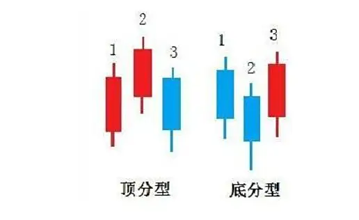
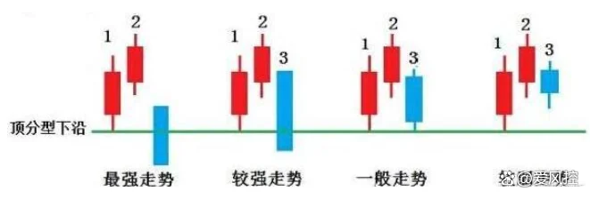
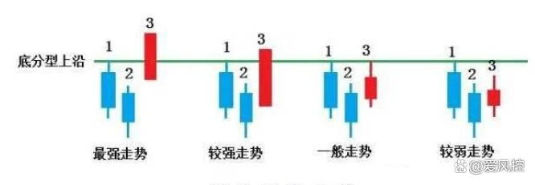
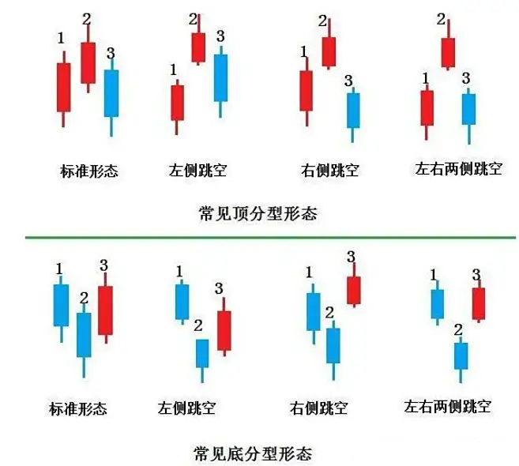

标准顶分型

一、顶分型的强度

以顶分型的下沿是否被形成顶分型的第3根K线有效击破来判断。分为超强趋势、最强走势、较强走势、一般走势和较弱走势五种。

最强走势：第3根K线为跌空低开并低走的大阴线，强力击穿顶分型下沿。收盘时阴线的跌幅越大，强度越强。

较强走势：从第2根K线的中下部开盘，且收盘以中大阴线击穿顶分型下沿。

一般走势：第3根K线最低点在顶分型下沿附近。

较弱走势：第3根K线最低点在顶分型的下沿之上。离下沿越远，强度越弱。

超强趋势：

1、左边阳线，中间最高点K线为阴线，右边也是阴线，第3根K线为跌空低开并低走的大阴线，强力击穿顶分型下沿。收盘时阴线的跌幅越大，强度越强。

2、左边阳线，中间最高点K线为阴线，右边也是阴线，从第2根K线的中下部开盘，且收盘以中大阴线击穿顶分型下沿。

3、第3根K线最低点在顶分型下沿附近。

4、第3根K线最低点在顶分型的下沿之上。离下沿越远，强度越弱。

二、底分型的力度

底分型的力度，是以底分型的上沿是否被形成底会型的第3根K线有效击穿来判断。也分为超强、最强、较强、一般和较弱五种。

最强走势：第3根K线为跳空高开高走的大阳线，并强势击穿底分型上沿。收盘时阳线涨幅越大，力度越强。

较强走势：第3根K线从第2根K线的中上部开盘，并以中大阳线收盘，且击穿底分型上沿。

一般走势：第3根K线收在底分型的上沿附近。

较弱走势：第3根K线收在底分型的上沿之下。离上沿越远，强度越弱。

超强趋势：

1、左边阴线，中间最高点K线为阳线，右边也是阳线，第3根K线为跳空高开高走的大阳线，并强势击穿底分型上沿。收盘时阳线涨幅越大，力度越强。

2、左边阴线，中间最高点K线为阳，右边也是阳线，第3根K线从第2根K线的中上部开盘，并以中大阳线收盘，且击穿底分型上沿。

3、第3根K线收在底分型的上沿附近。

4、第3根K线收在底分型的上沿之下。离上沿越远，强度越弱。

三、分型常见形态

